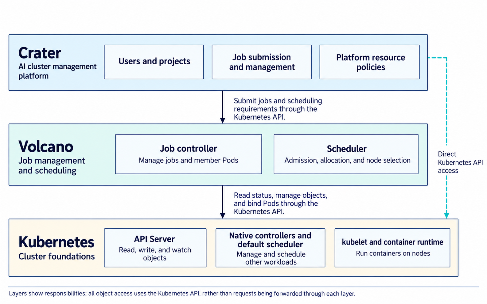
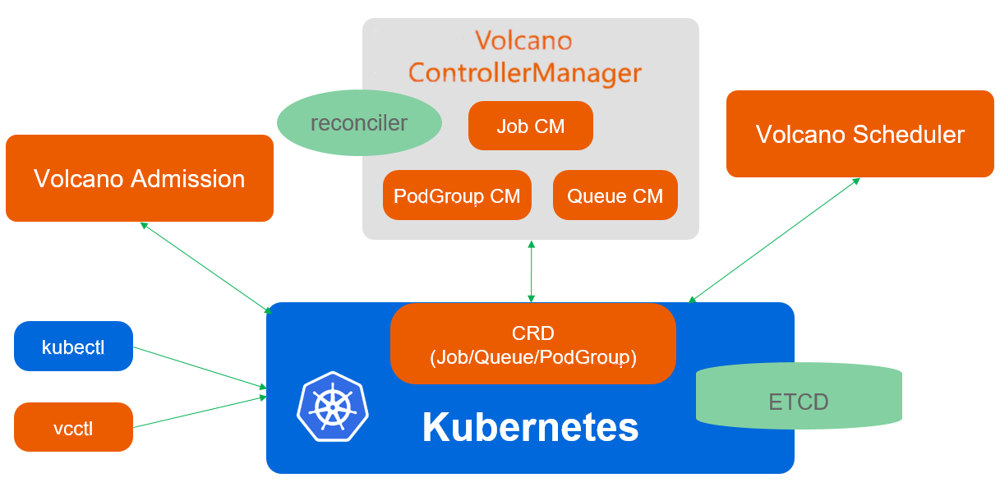
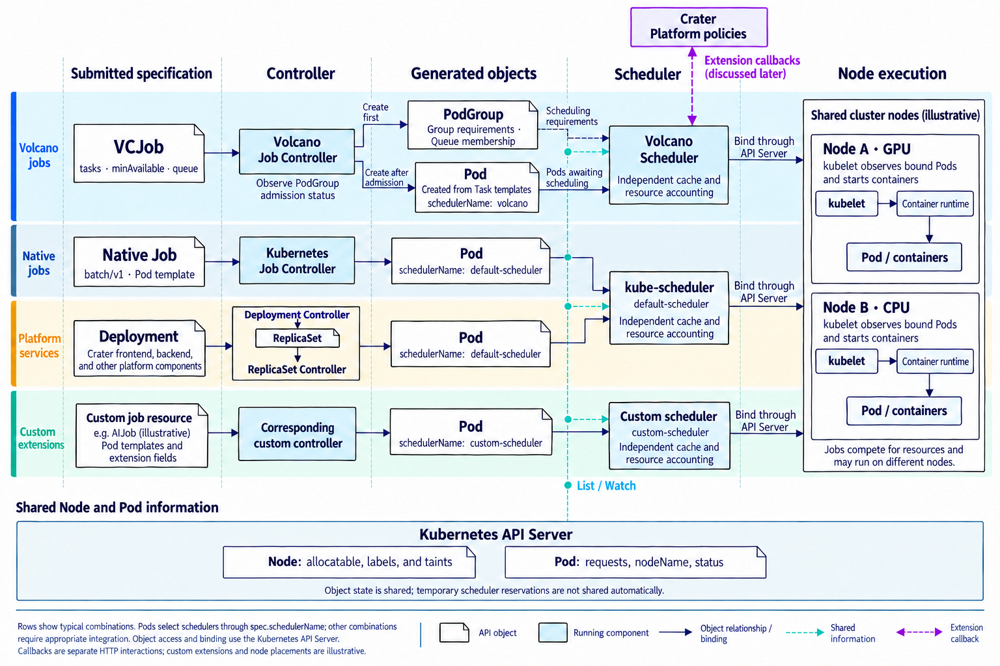
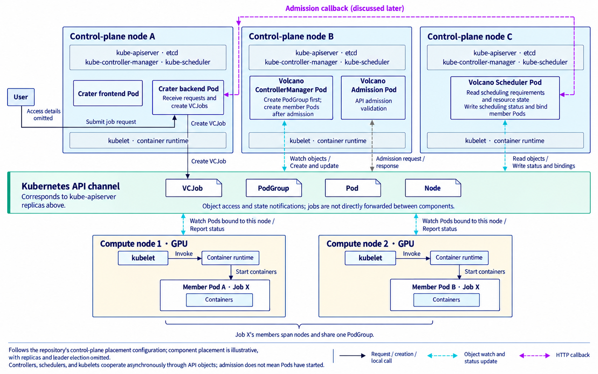
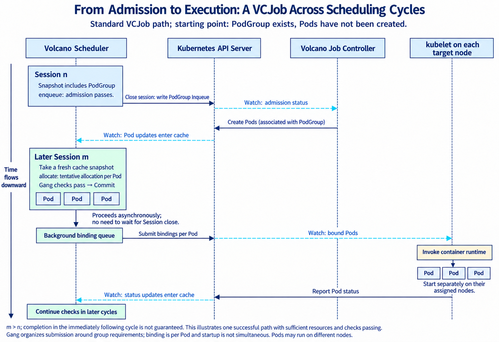
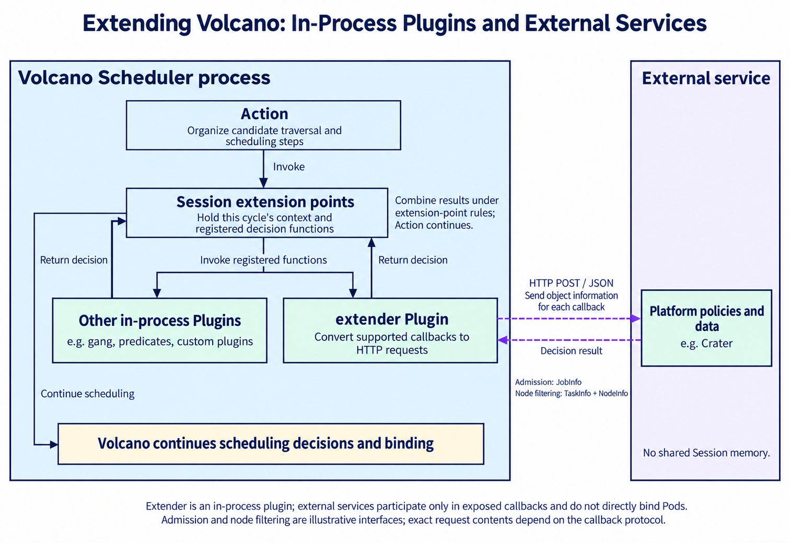

How Volcano Admits and Schedules AI Jobs

First, some background. Crater is an open-source AI cluster management platform we develop on top of Kubernetes. It helps users run training and inference workloads on the cluster's GPUs and other resources, or launch development environments such as Jupyter.

When we first designed the platform—actually, when the senior students in our lab designed it—we decided to use Volcano for job scheduling. Volcano is a batch processing and job scheduling system built on Kubernetes that coordinates resource allocation for jobs. That is also where Crater gets its name: a crater is the opening of a volcano.

I seem to mention Crater in every post here. Then again, this series was more or less created around the project :)

The diagram below gives an initial view of their responsibilities: Crater provides the user-facing platform, Volcano manages and schedules jobs, and Kubernetes provides the cluster's underlying capabilities.



Drawing on our experience with Volcano in Crater, this post explains how Volcano itself organizes, admits, and schedules jobs, following the standard VCJob workflow. How Crater organizes platform jobs and integrates its own management and admission rules into this mechanism will be the subject of the next post.

Implementation details follow [Volcano v1.15.3](https://github.com/volcano-sh/volcano/releases/tag/v1.15.3), the latest stable release at the time of writing (October 7, 2026), rather than the version deployed in Crater's cluster. For optional policies and features, I will explain when they take effect.

# How Volcano Organizes Jobs and Schedules Resources

Volcano coordinates compute resource allocation for batch processing and high-performance computing workloads, including AI training. Its design therefore needs to account for how these workloads cooperate. Distributed training usually involves multiple processes performing computation and communication together; when they run across nodes, multiple Pods must host those processes. If only some of those Pods receive resources, they may hold GPUs while waiting for the others. If several jobs each start only partially, they can occupy resources that the others need, leaving all of them unable to make progress.

Volcano therefore incorporates group requirements into scheduling: it checks both whether an individual Pod can receive resources and whether the group meets its minimum requirements. Meanwhile, jobs from different teams compete for resources in a shared cluster, so the scheduler must determine their shares and allocation order. These two needs are represented by the scheduling group, PodGroup, and the resource queue, Queue, introduced below.

We will work through this in three stages:

1. Build an overall picture: how components divide their responsibilities, and how jobs, Pods, groups, and queues relate to one another.
2. Walk through a scheduling cycle: how jobs are admitted, how nodes are assigned, and how backfilling, preemption, and reclamation run when configured.
3. Explore extensions: which requirements configuration can express, which need custom policies, and how an external platform can participate in scheduling decisions.

## The Responsibilities of Volcano and Kubernetes

First, let's connect a "job" to the units that actually run its programs. A training run or data processing task submitted by a user is a complete piece of work, which we call a job. Its programs execute in containers, and Kubernetes organizes those containers into Pods. A job may need just one Pod, or multiple Pods that divide the work among them.

A Pod is Kubernetes' smallest deployable unit and contains one or more closely cooperating containers. Containers in the same Pod run on the same node, share a network environment, and can mount the same storage volumes. The scheduler selects a node for the whole Pod, so a job spanning multiple nodes needs multiple Pods to host its programs. See the [Kubernetes Pod documentation](https://kubernetes.io/docs/concepts/workloads/pods/).

In this post, I call the Pods participating in a job its "member Pods," counting Pod objects. A Pod can contain multiple containers and run multiple processes; the member count here does not count containers, processes, or types of roles.

Putting programs into Pods does not yet solve how to start the whole job. Something must create its members from the specification and handle failures; something must coordinate resources and choose nodes for those members; and the nodes must then start the programs. Controllers, schedulers, and kubelets handle these responsibilities respectively. Volcano provides its own job controller and scheduler, which can coexist with Kubernetes' native controllers and default scheduler in the same cluster:

- The job controller manages members and their lifecycle: it creates Pods from the job specification, tracks execution results, and handles completion, failures, and retries according to policy.
- The scheduler decides resource allocation and node placement: Volcano determines whether a job can participate in allocation and which job to consider first, then chooses nodes for member Pods and submits bindings.
- The kubelet on each node handles execution: once a binding determines a Pod's node, the kubelet works with the container runtime to prepare the environment and start its containers.

This is the division of responsibilities: Volcano manages jobs and coordinates resource allocation, while Kubernetes continues to provide underlying capabilities such as storing API objects, managing nodes, and running containers. The official architecture diagram illustrates their relationship.



Image source: [Volcano's official architecture documentation](https://volcano.sh/docs/v1.13.0/home/architecture/).

To separately express "what a job should run," "which members need to be scheduled together," and "how multiple jobs share resources," Volcano introduces three custom resources: Job, PodGroup, and Queue. They store specifications, while controllers continuously maintain the corresponding objects and their status. ControllerManager in the diagram manages these controllers, watching and updating objects through the API Server. Job CM, PodGroup CM, and Queue CM divide their responsibilities as follows; we will examine the object relationships later:

| Controller in the diagram | Main responsibilities |
| --- | --- |
| Job CM | Manages Volcano Jobs: maintains their PodGroups and member Pods from job specifications, tracks job status, and handles completion, failures, and retries according to policy. |
| PodGroup CM | Creates a group and writes association information for ordinary Pods that specify Volcano but do not yet belong to a PodGroup, allowing these workloads to enter Volcano's scheduling workflow. The Job controller maintains PodGroups for VCJobs. |
| Queue CM | Manages queue states such as open and closed, advancing state transitions based on the PodGroups in each queue. With hierarchical queues, it also coordinates the open and closed states of parent and child queues. |

These controllers maintain jobs and their scheduling specifications. The Scheduler then uses those specifications and the cluster's resource state to perform admission, resource allocation, and node selection. A key distinction: the PodGroup controller does not choose nodes for members, and the Queue controller does not calculate how many resources each job should receive in each cycle. See the [Volcano controller implementations](https://github.com/volcano-sh/volcano/tree/v1.15.3/pkg/controllers) for these responsibilities. The next section explains the object relationships.

Admission in the diagram handles defaulting and API validation when objects are created or modified, while vcctl is the command-line client. Two stages here are easy to confuse:

- API admission: processes object creation and modification requests and checks whether those requests can be accepted.
- Job admission for scheduling: processes jobs that already exist and determines whether they can now participate in resource allocation.

Successful submission, admission, node assignment, and container startup therefore happen at different times.

## Jobs, Members, and Scheduling Groups

A training run usually has a clear completion goal. When a Pod exits, the work may be complete, or a retry may be needed. Distributed training also requires checking other members to determine the result of the whole job. In addition to the Pods hosting programs, we therefore need a higher-level object that declares completion conditions and retry rules, with a controller continually advancing the workflow.

Kubernetes' native Job represents this kind of work that runs to completion. The user supplies a Pod template and specifies parallelism, the required number of completions, and retry requirements. The Job Controller creates Pods and tracks results until completion or failure conditions are met. A Pod template is the configuration used to create members, including container images, startup commands, and resource requirements. See the [Kubernetes Job documentation](https://kubernetes.io/docs/concepts/workloads/controllers/job/).

A distributed job may also contain different roles, each running a different program and requiring a different number of replicas. Volcano therefore provides its own Job resource, abbreviated as VCJob, which organizes these roles through Task definitions. Each Task stores a role's name, Pod template, and replica count; the Volcano Job Controller manages member Pods accordingly.

For example, one coordination role and one compute role with three replicas correspond to two Task definitions and four Pods. The Pod names below are illustrative; the arrows show the controller creating replicas from templates.

```text
VCJob: the specification for the whole job
└── spec.tasks: role definitions within the job
    ├── master: replicas = 1  →  Pod master-0
    └── worker: replicas = 3  →  Pods worker-0, worker-1, worker-2
```

A Task is an entry in a VCJob's `spec.tasks` list, not an independently created API resource. The list order does not automatically express execution dependencies between roles. A native Job uses a single Pod template directly and has no such role list. Their APIs are `batch/v1` and `batch.volcano.sh/v1alpha1`, respectively, and each is handled by its own controller. See the [Volcano Job documentation](https://volcano.sh/docs/concepts/volcanojob/) for the relevant fields.

We now have a way to describe the job's work and members. To schedule interdependent members as a whole, however, the scheduler also needs to know which Pods belong to the same group and the minimum number of Pods and resources that group requires. Volcano introduces PodGroup as an independent custom resource to declare these group scheduling requirements. Gang Scheduling, discussed later, organizes allocation around these minimum requirements, avoiding the submission of a partial set of Pods that cannot meet them. Separating scheduling requirements from VCJob also lets other compute frameworks retain their own job controllers while integrating with gang scheduling through Volcano PodGroups.

In the standard VCJob workflow discussed here, one VCJob corresponds to one PodGroup, and all member Pods generated by its Tasks belong to that group. Both describe the whole job: VCJob declares its workload and lifecycle policies, while PodGroup declares the group scheduling requirements for those members. Each Task does not get its own PodGroup.

The Job Controller creates and maintains this PodGroup from the job specification, and identifies each member's group when creating its Pod. The scheduler uses that association to connect the members and read the requirements for the whole group. PodGroup expresses the scheduling relationship; the job controller still creates the member Pods. A PodGroup and its members are in the same namespace.

With group membership established, the scheduler also needs to know what counts as the minimum runnable size. Counting Pods alone is insufficient because different members may request different resources. Looking only at total resources is also insufficient because the required members may still be missing even when resources are available. PodGroup therefore declares separate minimum requirements for member count and resource quantities:

| PodGroup field | Requirement expressed | Source in the VCJob workflow |
| --- | --- | --- |
| `spec.minMember` | Minimum number of members required for the whole group, counted as Pods. | VCJob's `spec.minAvailable`. |
| `spec.minResources` | Minimum resource requirements for the whole group used during admission, declared separately for CPU, memory, and other resources. | Calculated by the controller from member specifications. |
| `spec.minTaskMember` | Minimum Pod counts by role, used by role-level checks where applicable. | Generated by the controller from settings such as each VCJob Task's `minAvailable`. |

See the [PodGroup documentation](https://volcano.sh/docs/concepts/podgroup/) and [creation implementation](https://github.com/volcano-sh/volcano/blob/v1.15.3/pkg/controllers/job/job_controller_actions.go) for the fields and mappings.

These minimum requirements guide scheduling decisions; declaring them does not immediately grant resources. The scheduler must still perform admission and allocation and check whether the group conditions can be met. Meeting the minimum member requirement also does not mean that all replicas have been allocated or that all containers will start simultaneously.

The four Pods in the earlier example belong to the same PodGroup:

```text
PodGroup corresponding to the VCJob: stores this group's scheduling requirements
└── Associated through group annotations on member Pods:
    master-0, worker-0, worker-1, worker-2
```

Task definitions are contained in the VCJob. Pods are independent objects created from those definitions. PodGroup associates those Pods but contains neither Task definitions nor Pod templates. In this example, the PodGroup associates four Pods, not two Tasks. Both it and the member Pods are managed by the Job Controller and record their owning VCJob through `ownerReferences`. Group association and object ownership express different relationships. See the [member Pod creation implementation](https://github.com/volcano-sh/volcano/blob/v1.15.3/pkg/controllers/job/job_controller_util.go).

> Some jobs also need to divide members into smaller cooperating groups, with separate scheduling and network topology constraints within each group. A Task's `partitionPolicy` can declare these grouping rules, which the controller writes into `subGroupPolicy` on the same PodGroup. These subgroups still belong to the original PodGroup.

As mentioned earlier, Volcano's controllers and scheduler can coexist with Kubernetes' native components. With the object relationships clear, we can now explain which controller manages a job and which scheduler handles its member Pods.

A job resource's type is identified by `apiVersion` and `kind`. Controllers actively watch the types they handle: by default, the Kubernetes Job Controller handles native Jobs, and the Volcano Job Controller handles VCJobs. A controller must implement the management logic for the corresponding resource. The API Server does not actively dispatch jobs to a particular controller, and changing a Pod's scheduler name does not make these controllers interchangeable.

The scheduler is selected at the Pod level, through `spec.schedulerName` on the resulting Pod. Job controllers and Pod schedulers can therefore be combined. Common paths include:

| Job resource | Controller managing the job | Scheduler used by its Pods |
| --- | --- | --- |
| Native Job | Kubernetes Job Controller | `default-scheduler` |
| Native Job | Kubernetes Job Controller | `volcano` |
| VCJob | Volcano Job Controller | `volcano` |
| Custom job resource, such as AIJob | Its corresponding custom controller | Selected according to integration requirements, for example a custom scheduler |

This choice must ultimately appear in the Pod's `spec.schedulerName`, but where it is specified in the job declaration differs:

- Native Job: specify it in `spec.template.spec.schedulerName`.
- VCJob: usually set the job-level `spec.schedulerName`; the controller copies it into member Pods when their templates do not specify one.

Changing this field only changes who schedules the Pods. It does not make the native controller take over VCJobs or automatically give native Jobs every VCJob capability. To use Volcano's gang scheduling, a native Job still needs an associated PodGroup with the required minimum size. An automatically created group may not express the actual requirements for the whole job. See [Kubernetes' multiple-scheduler mechanism](https://kubernetes.io/docs/tasks/extend-kubernetes/configure-multiple-schedulers/) and the member creation implementation above.

In Crater, ordinary user jobs use VCJob and the Volcano Scheduler, while platform components such as the frontend and backend use native Deployments and the default scheduler. We have also used other job types and schedulers when researching scheduling algorithms. These practices show that a single cluster can support multiple combinations. Below, we will continue to focus on jobs managed by Volcano.

After the selected scheduler finds a node for a Pod, it submits a binding through the API Server. The result appears in the Pod's `spec.nodeName`, and the kubelet on the target node then handles execution. These two fields represent the selection of a scheduler and the resulting node assignment:

```text
Pod.spec.schedulerName  →  Who selects the node
Pod.spec.nodeName       →  Which node has been assigned
```

The final binding is between a Pod and a node; it does not bind an entire Job or PodGroup to one node. See the [Kubernetes scheduling workflow](https://kubernetes.io/docs/concepts/scheduling-eviction/kube-scheduler/).

The following diagram brings these relationships together. The VCJob path at the top is the focus of this post; the other paths help compare the responsibilities of controllers and schedulers.



Each row shows a typical combination. The actual workflow advances through changes in object state: the Volcano Job Controller first creates the PodGroup, then creates member Pods after observing a change in admission status. The Volcano Scheduler subsequently assigns nodes to those Pods. In the diagram, native Job and Deployment Pods go to the same default scheduler, while custom jobs illustrate another extension path. All Pods still select their scheduler through `spec.schedulerName`, and other combinations must meet the relevant integration requirements. Custom extensions and node placement are illustrative.

From the node perspective, Volcano's controllers and scheduler are themselves Pods running on nodes. The diagram below follows Crater's deployment approach by placing them on control-plane nodes. This is one possible layout; the specific placements are illustrative.



Volcano updates objects and binding results through the API Server. Each node's kubelet then starts the containers in the Pods assigned to it. Members of the same job can be spread across multiple nodes while remaining associated with one PodGroup. The API channel in the diagram represents access to kube-apiserver. The Crater callback only marks the platform extension point; the next post will explain the integration.

When observing progress along this workflow, we must also distinguish "how far the whole job has progressed" from "how far one member has progressed." One member starting does not mean the whole group is ready, and the whole group receiving nodes does not mean training is complete. Status is therefore recorded on the corresponding objects:

| Object whose status is recorded | What it records |
| --- | --- |
| VCJob | The execution lifecycle of the whole job. |
| PodGroup | Progress of group admission and scheduling. |
| Pod | The execution state of a specific instance. |

When Pending, Inqueue, and Running appear later, I will explain them in the context of the relevant object so that allocation and actual execution are not confused.

## Queues and Resource Accounting

PodGroup addresses gang scheduling within a job. In practice, however, multiple teams usually share a cluster, and each team has multiple users and jobs. Teams may have different resource entitlements: some have larger GPU quotas, while some workloads need priority protection. If only individual jobs are ordered, a team that submits many jobs could keep occupying resources, making it difficult to enforce the allocation rules agreed between teams.

We therefore need to group jobs from the same team or workload category, aggregate their resource allocations, and allocate resources between these groups. Volcano uses Queue to express this resource attribution and allocation policy. A platform can put a team's jobs in one Queue or divide them by workload category. The platform or submitter establishes the mapping between teams and queues.

Queue is a cluster-scoped custom resource with the API `scheduling.volcano.sh/v1beta1`. It can be associated with PodGroups from multiple namespaces. The controller copies a VCJob's `spec.queue` into its PodGroup's `spec.queue`, determining which queue accounts for the resources allocated to these members:

```text
VCJob.spec.queue → PodGroup.spec.queue → Queue name
                                            ↑
                           Aggregates allocations across multiple jobs
```

Once ownership is established, the first question is "how many resources can each team receive?" There are two distinct needs: when resources are scarce, each team should receive its agreed share; when resources are idle, teams with demand should be allowed to use more so that devices do not sit unused. The entitled share and maximum allocation must therefore be declared separately. Shares can be specified as explicit resource quantities or calculated from relative weights:

| Queue field | Meaning and limits |
| --- | --- |
| `spec.capability` | Resource ceiling: limits the amount the queue can be allocated, separately for CPU, memory, GPU, and other dimensions. Available quota does not mean the Pods will necessarily fit on nodes. |
| `spec.deserved` | Entitled share: explicitly declares the queue's resource share. Other queues can borrow unused shares, which can later be taken back under reclamation rules; this is not a hard ceiling. |
| `spec.weight` | Relative weight: with a policy that allocates by weight, this is used together with demand and resource ceilings to calculate the queue's entitled share. A weight is not a fixed resource quantity. |

Once unused shares can be borrowed, rules are also needed for taking them back. Some workloads need a reserved amount that other teams cannot borrow. For borrowable resources, it must be clear whether the queue using them permits cross-queue reclamation. Resource competition may also require giving certain workloads priority. Another set of fields expresses these requirements:

| Queue field | Meaning and limits |
| --- | --- |
| `spec.guarantee.resource` | Reserved resources: under a resource policy that supports this field, reserves an amount for this queue that others cannot borrow. It neither reserves specific nodes nor guarantees that jobs start immediately. |
| `spec.reclaimable` | Whether resources can be reclaimed across queues: controls whether this queue can be a target of reclamation by other queues. It does not mean its Pods cannot be terminated for other reasons. |
| `spec.priority` | Queue priority: policies supporting this field use it to order queues, considering higher values first. It is distinct from an individual job's or Pod's priority. |

If resources must first be allocated to departments and then to teams, `spec.parent` can establish parent-child queues and organize policies hierarchically. Together, these fields describe resource entitlements; the scheduler applies the enabled policies. Setting a field does not by itself select a particular algorithm. See the [Queue API](https://github.com/volcano-sh/volcano/blob/v1.15.3/staging/src/volcano.sh/apis/pkg/apis/scheduling/v1beta1/types.go) for field definitions. We will explain share calculation, ceiling checks, and reclamation in the corresponding scheduling steps.

Queue thus expresses the resource entitlements shared by a set of jobs. It does not inherently require FIFO order or exclusive use of a set of nodes. After policy permits an allocation, the scheduler must still check whether resources are actually available. Every allocation needs checks at two levels:

- Queue level: do share, ceiling, and other policies permit further allocation?
- Node level: are there specific nodes that meet capacity, affinity, and other requirements?

A queue may have quota left while the cluster has no suitable nodes. Nodes may be idle while queue policy prevents further allocation.

To connect queue policy with node capacity, we also need a consistent definition of "how many resources are occupied." Actual utilization fluctuates during training, but a temporary pause in computation does not return allocated resources to the scheduler. Both kinds of accounting therefore primarily use Pod resource requests, which must be distinguished from runtime limits and monitored usage:

| Information | What it expresses |
| --- | --- |
| Pod `requests` | Declared resource needs; the accounting basis for ordinary CPU, memory, and extended-resource scheduling. |
| CPU and memory `limits` | Runtime usage ceilings for containers; they do not mean the same quantities were reserved during scheduling. |
| Actual usage in monitoring | Resources consumed at the moment; a drop in usage does not automatically revoke existing allocations. |
| Node `status.allocatable` | Capacity available for Pods, before subtracting existing allocations. |

For example, a Pod allocated an entire GPU still holds that resource even when it temporarily does no computation. Remaining node capacity must be calculated by subtracting resource requests counted as occupied from allocatable capacity, separately for each node and resource. Total free resources across the cluster cannot substitute for this. A queue aggregates allocations attributed to it; its quota constrains scheduling allocations, rather than acting as an aggregate runtime ceiling on all containers' actual usage. See the [Kubernetes resource management documentation](https://kubernetes.io/docs/concepts/configuration/manage-resources-containers/).

As noted earlier, multiple schedulers can run in one cluster. Pods scheduled by all of them share node capacity, so Volcano must also account for Pods bound by other schedulers on the nodes it manages when assessing remaining capacity. It watches Nodes and Pods through the API Server to obtain this information. Sharing the source of information, however, differs from sharing accounting during scheduling:

```text
Shared object information: Nodes, bound Pods, and other Kubernetes API objects
Independently maintained state: scheduler caches and temporary scheduling reservations
```

Shared cluster information therefore does not amount to one resource ledger synchronized in real time, and temporary reservations are not automatically communicated to other schedulers. When multiple schedulers concurrently use the same nodes, they can still compete for the same resources. Sharing API information alone does not establish that allocation has been coordinated.

With these objects and accounting relationships in place, we can examine how the scheduler turns specifications into decisions: first checking whether jobs can participate in allocation, then selecting members under queue and job policies, finding nodes for Pods, and checking group requirements. Share comparisons, borrowing, and reclamation will be explained in their corresponding steps.

# A Volcano Scheduling Cycle

A scheduling cycle aims to advance job admission and resource allocation as far as policies permit, based on the cluster state currently visible to the scheduler. It does not merely select the single highest-priority job. The scheduler continues processing candidates in the cycle, admitting jobs that pass the checks and assigning nodes to eligible Pods. One cycle can therefore advance multiple jobs and allocate multiple Pods. Priority determines who is considered first; processing the first job does not end the cycle.

There are limits to this effort. The algorithm checks candidates in a prescribed order, subject to queue policies, node conditions, and group requirements. It does not exhaustively search every placement combination for a global optimum. An unsuccessful attempt does not mean that no mathematically feasible placement exists.

## Scheduling Cycles and Policy Organization

Volcano's scheduler continuously watches Kubernetes objects and maintains the observed Nodes, Pods, PodGroups, Queues, and other information in its cache. A scheduling cycle needs a defined input on which to base a sequence of decisions, so it first takes a cache snapshot and then creates a Session for that cycle.

A Session is an in-process scheduling context, created at the beginning of a cycle and released after the cycle closes. It is not a Kubernetes API resource and does not correspond to a single job. Multiple jobs compete for resources in the same Session, and all scheduling steps share that context.

A Session mainly contains:

- Jobs and Pods: the jobs, Pods, queue membership, resource requests, and group requirements visible in the cycle.
- Nodes and resources: candidate nodes, allocatable capacity, existing allocations, and the remaining capacity and expected releases used for this cycle's calculations.
- Queue policies and accounting: each queue's allocation constraints and policy-maintained figures such as allocated resources and admitted demand.
- Policies and decision functions: enabled policies and rules for ordering, admission, node filtering, group checks, and other decisions.

The cycle's base input is fixed, while resource accounting and scheduling state continue to change as decisions are made. These boundaries fall into three categories:

| Information category | How it is used in the cycle |
| --- | --- |
| Base snapshot and configuration | Once the jobs, nodes, queues, and policy configuration for the cycle are selected, external updates do not automatically reload them. Base quantities such as total allocatable node capacity are calculated from this input. |
| Decisions and accounting within the cycle | Admission, tentative allocation, and rollback change internal state and resource accounting. Later decisions must see the effects of earlier operations, and rolling back an attempt must restore the corresponding accounts. |
| External object changes | Changes such as newly created Pods and released node resources continue entering the cache and are incorporated through fresh snapshots in later cycles. |

For example, after one Pod receives a tentative allocation, the next Pod must use the remaining capacity after that allocation is subtracted. A new Pod just created by a controller, however, is not inserted directly into the current cycle's candidates. This is the difference between computing from a snapshot and updating accounting throughout the cycle.

The snapshot does not lock the entire cluster. Storage, device, and other plugins may access additional caches or APIs, and background binding can still succeed or fail. A Session fixes the scheduler's main working set; it does not atomically freeze all external information. See [Session initialization and closing](https://github.com/volcano-sh/volcano/blob/v1.15.3/pkg/scheduler/framework/session.go) and [cache snapshots](https://github.com/volcano-sh/volcano/blob/v1.15.3/pkg/scheduler/cache/cache.go).

With this context in place, the following pseudocode summarizes a scheduling cycle. It preserves execution order and loop boundaries while omitting details such as logs and metrics. We will use its step numbers below:

```text
Continuously in the background: watch Kubernetes objects and update the scheduler cache

Whenever a new scheduling cycle begins:
    cycleConfig = read current scheduling configuration
    Session = openSession(cache snapshot, cycleConfig)       // ①
              initialize policies and resource accounting for this cycle

    try:
        for Action in cycleConfig.actions (in configured order):
            execute Action(Session)
            // enqueue: traverse this cycle's admission candidates       // ②
            // allocate: loop through queues, jobs, and Pod allocations  // ③
            // backfill or configured preemption/reclamation:
            //     perform additional allocation or adjust resource use // ④
    finally:
        close Session                                                   // ⑤
        finalize policies, update object status, release the cycle's context

Later cycles: take a new snapshot and open a new Session
Background binding and controller responses: advance independently;
    their results feed back into the cache through object changes
```

Each iteration of the outer `for` executes one complete Action. Steps ② and ③ have their own loops for processing candidates; this outer loop does not process just one job at a time. The numbers organize the explanation; the actual execution order is determined by the `actions` list. The built-in default configuration in v1.15.3 is:

```yaml
actions: "enqueue, allocate, backfill"
```

A default cycle therefore executes ②, ③, and the `backfill` part of ④ in sequence, then proceeds to ⑤. Preemption and reclamation must be enabled separately and run at their configured positions. A failed allocation does not automatically invoke every other Action, and completing those Actions does not automatically rerun `enqueue` or `allocate`. See the main loop in the [Scheduler implementation](https://github.com/volcano-sh/volcano/blob/v1.15.3/pkg/scheduler/scheduler.go) and the [default configuration](https://github.com/volcano-sh/volcano/blob/v1.15.3/pkg/scheduler/util.go).

Actions organize the steps; Plugins supply the decision rules. For example, `allocate` organizes the loop that selects a queue, selects a job, filters nodes, and attempts allocation. The specific ordering and resource checks come from functions that plugins register when the Session opens.

The following table lists Volcano scheduling Plugins and their responsibilities. These names correspond to `tiers[].plugins[].name` in the scheduler configuration. For example, `name: gang` enables the Gang plugin. A plugin participates in a step only when its corresponding checks are enabled through configuration.

| Question the scheduling process must answer | Plugin names | Decisions supplied by the plugins |
| --- | --- | --- |
| Which job or Pod should be considered first? | `priority`, `gang` | `priority` compares priorities; `gang` participates in job and subgroup ordering based on group readiness. |
| How should different jobs' use of multiple resources be compared? | `drf` | Compares dominant resource shares and participates in decisions such as job ordering. |
| How many more resources can a queue receive? | `proportion`, `capacity` | `proportion` calculates shares from weights, demand, and ceilings; `capacity` manages allocation using explicitly declared shares and can handle hierarchical queues. |
| Can a Pod be placed on a particular node? | `predicates` | Checks node constraints, resources, and related conditions. |
| Which node should be selected when several are suitable? | `nodeorder` | Scores candidate nodes. |
| Does the current allocation satisfy the whole group's requirements? | `gang` | Checks job, role, and configured subgroup requirements. |

Plugins do not each run a complete scheduling pass. An Action invokes different decision functions at different points, and one plugin can participate at multiple points. The configured `tiers` group plugins into layers; how their results are combined depends on the decision type. For ordering, the first nonzero comparison result in configuration order usually determines the outcome. Admission uses the tiered voting rules explained in ② below. The plugin list is not another fixed execution pipeline.

Before looking at the algorithm, we need to distinguish Kubernetes resource objects, the scheduler's internal representations, and the data structures holding candidates. Their names are not interchangeable:

| Kubernetes object or specification | Internal scheduler representation | Variable in this post's pseudocode |
| --- | --- | --- |
| A Queue resource: the resource queue introduced earlier | `QueueInfo`: holds information about that Queue for the scheduler. | `queueInfo` |
| A PodGroup and its associated Pods, together forming a scheduling job | `JobInfo`: aggregates the group's scheduling requirements and information about its Pods. | `jobInfo` |
| A specific Pod | `TaskInfo`: holds that Pod's resource requests, node, and internal scheduling state. | `taskInfo` |
| A Node | `NodeInfo`: holds node information and resource accounting maintained by the scheduler. | `nodeInfo` |
| An entry in a VCJob's `spec.tasks` | A role definition that can generate multiple Pods, and therefore correspond to multiple `TaskInfo` objects. | Not treated as a single object awaiting allocation. |

One scheduling job therefore corresponds to a `JobInfo`, which can contain multiple `TaskInfo` objects; each `TaskInfo` corresponds to one Pod. A VCJob's Task role definition is also distinct from `TaskInfo`. Standard VCJobs enter this representation through their corresponding PodGroups, but other job frameworks can integrate through PodGroups too. `JobInfo` is therefore not restricted to representing VCJob resources.

The word "queue" creates another ambiguity. Queue is an API resource declaring resource policy; a priority queue is an in-memory data structure used by the algorithm to order candidates. The latter can hold `QueueInfo`, `JobInfo`, or `TaskInfo` objects. To avoid confusion, I will call these algorithmic containers the "Queue candidate set," "job candidate set," and "Pod candidate set." Removing or reinserting an element changes only the processing order within this cycle. It does not create or delete Queue resources or change a job's queue membership.

The prose continues to use "job" and "Pod" to explain scheduling behavior, while the pseudocode consistently uses the variable names above to identify internal objects. `Allocated`, `Pipelined`, and `Binding` are internal `TaskInfo` scheduling states, not values of a Kubernetes Pod's `status.phase`.

## enqueue: Deciding Whether Jobs Can Participate in Resource Allocation

Step ② checks the cycle's admission candidates in order, allowing jobs that pass admission to enter the allocation stage. After admitting one job, the Action continues considering others. Rejecting a higher-priority job does not make the current implementation stop checking the entire queue.

First, distinguish two meanings of "entering a queue." A job's `spec.queue` associates it with a Queue and establishes resource attribution. `enqueue` advances its PodGroup to `Inqueue`, establishing that it has passed the current admission checks. A PodGroup can already belong to a Queue while remaining `Pending`, waiting for admission.

This process has four steps:

1. Collect candidates. Take jobs whose PodGroup phase is empty or `Pending` from the Session, group them by Queue, and build a Queue candidate set holding `QueueInfo` objects and a corresponding `JobInfo` candidate set for each Queue. Jobs without a PodGroup or whose Queue does not exist are excluded when the snapshot is created.
2. Select the next job. Remove a `QueueInfo` from the Queue candidate set, then remove the currently preferred `JobInfo` from that queue's job candidate set.
3. Check and update status. If admission conditions are met, invoke the enqueue notification function and change the corresponding PodGroup's phase in the Session to `Inqueue`. Otherwise, leave it awaiting admission.
4. Continue traversal. Reinsert the `QueueInfo` into the Queue candidate set and process other jobs until the cycle's candidates are exhausted. A job just rejected is not repeatedly retried within this invocation of `enqueue`.

At this point, all Pods need not exist yet. In particular, in the standard VCJob workflow, the Job Controller creates Pods only after observing the PodGroup's admission status advance. `enqueue` therefore does not first perform the Gang validity check for whether enough Pods exist; that belongs to the checks before allocation in ③.

Admission primarily checks whether current policy allows a job to advance. It does not find nodes for each of its Pods. Resource-related plugins, for example, make checks at these levels:

| Check level | What is being checked |
| --- | --- |
| Queue resource policy | Whether the queue is open and whether allocated resources, admitted jobs' resource demand, and this job's minimum demand remain within the effective quota. Hierarchical policies also check ancestor queues. |
| Cluster admission volume | For example, `overcommit` uses cluster capacity, used resources, and a configured admission multiplier to limit aggregate minimum resource demand entering allocation. |
| Extension policies | Configured admission extensions can add platform-specific checks; integration is discussed later. |

These checks generally use the PodGroup's `minResources`, rather than finding placements for every replica in advance. An admission multiplier lets some demand enter allocation ahead of resource availability; it does not allow later bindings to exceed node capacity.

The implementation combines these rules through `JobEnqueueable`. It checks `tiers` in order. A rejection in a tier immediately rejects the job. If that tier has no rejection and at least one explicit approval, it approves the job without continuing to the next tier. If every check returns neither a rejection nor an explicit approval, the final default is approval. The tier containing an extension policy therefore affects whether that policy is executed.

There is also an explicit special case: when a PodGroup's `minResources` is `nil`, `enqueue` skips these admission votes and goes directly to enqueue notification and the status update. This means the field is absent, not that its resource quantities happen to be zero. The controller calculates this field for standard VCJobs; integrations with other job types need to account for this boundary. See [enqueue](https://github.com/volcano-sh/volcano/blob/v1.15.3/pkg/scheduler/actions/enqueue/enqueue.go) and the [Session admission functions](https://github.com/volcano-sh/volcano/blob/v1.15.3/pkg/scheduler/framework/session_plugins.go).

Each admission also affects accounting within the cycle. For example, resource plugins account for demand that has been admitted but not yet fully allocated. Later jobs must be checked against those updated accounts, rather than each independently passing against the same available quota. This admission accounting still does not reserve specific nodes.

At the end of ②, a set of jobs has advanced to `Inqueue` in this cycle. They are eligible to proceed to allocation. Whether node conditions and group requirements can be satisfied remains for ③ to determine.

## allocate: Selecting Jobs and Assigning Nodes to Pods

Step ③ keeps attempting allocations within the cycle's candidates and policies, advancing jobs and Pods for which usable resources can be found. It handles both newly admitted jobs whose Pods already appear in the snapshot and jobs that have entered execution but still have Pods awaiting allocation.

At a high level, the scheduler first selects a Queue, then a job within it, and attempts to allocate resources to that job. Selecting Pods afterward progressively turns the selected job's allocation plan into specific Pod-to-node placements. The job expresses group requirements, while Pods are the units that request resources, match nodes, and receive bindings. The algorithm must therefore try the job's pending Pods individually, accumulate allocation results, and check group conditions. For jobs that already meet their minimum size, it can continue allocating remaining Pods.

Let's first look at the complete loop, then examine its checks. Steps ③-A and ③-B select the queue and job. Within the selected job, ③-C through ③-E repeat for individual Pods, using one Statement to record this attempt's reversible tentative allocations. Finally, ③-F decides whether to commit, wait for resource releases, or roll back. The example follows the ordinary path for Pods with resource requests, without additional subgroups or hard network topology constraints, and omits error-handling details:

```text
Collect candidates that pass preliminary checks:
    Queue candidate set: holds QueueInfo, ordered by queue rules
    Job candidate map: a JobInfo candidate set for each Queue
    Pod candidate map: a TaskInfo candidate set for each scheduling job

while the Queue candidate set is not empty:
    queueInfo = pop the currently preferred Queue candidate             // ③-A
    jobCandidates = Job candidate map[queueInfo.UID]
    if the queue-level Overused check requires skipping this Queue,
       or jobCandidates is empty:
        continue
    jobInfo = pop the currently preferred job from jobCandidates        // ③-B
    podCandidates = Pod candidate map[jobInfo.UID]

    result = attemptJobAllocation(queueInfo, jobInfo, podCandidates, Session)
    if result is committed and podCandidates is still nonempty:
        reinsert jobInfo into jobCandidates
    reinsert queueInfo into the Queue candidate set;
        subsequent comparisons use updated accounting

attemptJobAllocation(queueInfo, jobInfo, podCandidates, Session):
    statement = new operation record(Session)
        // Accumulate allocations for this job's current attempt

    while podCandidates is not empty:  // Always choose Pods from the current job
        taskInfo = pop the currently preferred Pod candidate            // ③-C
        if queueInfo's queue does not permit further allocation for this Pod:
            continue

        nodeInfo = filter and select a node(taskInfo, Session)            // ③-D
        if no suitable node exists:
            record the failure reason
            if further-allocation check finds minimum requirements
               can no longer be met:  // NeedContinueAllocating
                break
            continue

        if nodeInfo has sufficient current idle resources:              // ③-E
            statement.Allocate(taskInfo, nodeInfo)
        else if nodeInfo has sufficient expected available resources:
            statement.Pipeline(taskInfo, nodeInfo)
        // Successful operations immediately update this cycle's node and queue accounts

        if jobInfo now satisfies group readiness conditions:
            break

    if jobInfo now satisfies group readiness conditions:                // ③-F
        statement.Commit()    // Hand allocations to binding; do not wait for startup
        return committed
    else if group conditions are met when plans waiting for releases are counted:
        retain this cycle's plan without committing the unready placement
        return waiting for release
    else:
        statement.Discard()   // Roll back this attempt and restore its accounting
        return attempt failed
```

The inner loop accumulates attempts within one job; the outer loop continues selecting queues and jobs. An inner `break` ends only the current attempt within the group. The algorithm must still decide whether to commit, wait, or roll back; it does not end all of `allocate`. A failed attempt also rolls back only its own Statement, leaving previously committed allocations for this or other jobs intact.

`allocate` begins by collecting candidates. When `enqueue` is configured, it skips jobs whose PodGroup remains `Pending`. It then checks `JobValid`, queue existence, and relevant conditions such as topology. With `gang` enabled, `JobValid` checks whether the current valid Pod count can meet whole-group, role, and subgroup requirements. Jobs with too few valid Pods to satisfy these minimums wait for later cycles.

Pods themselves can also be gated: if a Pod's `spec.schedulingGates` has not been cleared, it cannot proceed directly to binding. The optional queue gating feature in v1.15.3 asynchronously removes the corresponding gates when quota permits. Allocation continues once the updates enter a later snapshot. This feature is disabled by default and does not affect the standard VCJob path followed here.

> If `enqueue` is not configured, `allocate` advances PodGroups awaiting admission to `Inqueue` so they are not permanently blocked from allocation. This is a fallback path when the admission Action is omitted, not evidence that ②'s admission checks have run. This post continues to follow a workflow that includes `enqueue`.

**③-A through ③-C: Comparing Queue, Job, and Pod Selection**

These three selections are nested: first a Queue, then a job in that Queue, then individual Pods within that job. Selecting a Pod puts the already selected job's allocation plan into practice; it does not independently choose another scheduling target.

All three candidate sets are implemented as heap-based priority queues, with their respective comparators determining which element is removed next. The table below follows the built-in default plugin configuration used in this post. Rules are compared in order, with later rules used only when earlier ones cannot distinguish the candidates.

| Comparison | ③-A: Select a Queue | ③-B: Select a Job | ③-C: Select a Pod to implement the chosen job's allocation plan |
| --- | --- | --- | --- |
| Main purpose | Decide which resource queue gets an allocation opportunity first. | Decide which job in the selected Queue gets an allocation attempt first. | Implement the plan for the job selected in ③-B: find nodes for its pending Pods in order, accumulate results, and check group conditions. This does not select an independent scheduling target. |
| Candidate scope | Queues with candidate jobs in this cycle. | Candidate jobs in the selected Queue only. | Pods awaiting allocation in the selected job only. |
| Priority queue contents | `QueueInfo`: corresponds to a Queue resource. | `JobInfo`: corresponds to a scheduling job consisting of a PodGroup and its associated Pods. | `TaskInfo`: corresponds to one Pod, not a Task role definition in VCJob. |
| Session comparator | `QueueOrderFn` | `JobOrderFn` | `TaskOrderFn` |
| Default ordering rules | • `proportion` first compares Queue `spec.priority`, preferring higher values.<br>• If equal, compare the ratio of allocation to entitled share, preferring the smaller ratio.<br>• If still equal, prefer earlier Queue creation time, then ascending UID. | • `priority` first compares job priority, preferring higher values.<br>• If equal, `gang` compares whether the whole-group ready count reaches `minMember`, preferring jobs that have not reached it. This does not yet check all role and subgroup conditions.<br>• If still indistinguishable, `drf` prefers the smaller dominant resource share.<br>• Finally, prefer the earlier creation time recorded in `JobInfo`, then ascending UID. | • `priority` first compares the Pod's internal priority, preferring higher values.<br>• If equal, try parsing the trailing replica index from its name format, preferring the smaller index.<br>• If either index cannot be parsed or both are equal, prefer earlier Pod creation time, then ascending UID. |
| Resource share calculation | For each resource, calculate "queue allocation ÷ queue entitled share" and take the largest ratio. When the Session opens, `proportion` calculates entitled shares from weights, demand, ceilings, and reservations. | For each resource, calculate "job allocation ÷ corresponding cluster capacity in this cycle" and take the largest ratio: the dominant resource share used by `drf`. | Default Pod ordering uses neither of the share ratios to the left. Resource requests and node constraints are checked during subsequent allocation. |
| What follows selection | Invoke the queue-level `Overused` check and proceed to ③-B unless skipped. Whether allocation quota remains for each Pod is checked separately in ③-D. | Start an allocation attempt for this job and enter the Pod loop in ③-C through ③-E. | Check quota and find a node in ③-D, then record tentative allocation in ③-E. Results accumulate in the Statement for this job's current attempt. |
| How processing continues | After a job allocation attempt, reinsert `queueInfo` into the candidate set. Later comparisons use updated accounting. | After group requirements are satisfied and the attempt is committed, reinsert `jobInfo` into this Queue's job candidate set if Pods remain. | If group conditions are not yet satisfied and further attempts are allowed, choose the next Pod from the same job. Once conditions are met or the attempt ends, proceed to ③-F to commit, wait, or roll back. |
| Limits of selection | Earlier ordering gives an earlier check opportunity, without guaranteeing available allocation quota. | Selecting a job once does not require allocating all its Pods. | Ordering determines only the attempt sequence within the group. It does not express role execution dependencies or mean that this Pod's binding can be committed independently. |

The plugins in the table participate in comparisons through `tiers` and the configuration order within each tier. A plugin comparator returns a negative value when the left candidate is preferred, a positive value when the right candidate is preferred, and zero when it cannot distinguish them. The first nonzero result determines the order. Changing plugin configuration also changes these comparison rules.

Queue-level checks also depend on the plugin and cannot universally be interpreted as "stop at the entitled share." `proportion` restricts further allocation according to the shares calculated for the cycle. With `capacity`, Queue `deserved` is the share baseline, while subsequent allocations also check `capability`, reservations, and hierarchical constraints. When the relevant conditions are met, a queue can use more than its entitled share, with later adjustments governed by reclamation policy.

See the [Session comparators](https://github.com/volcano-sh/volcano/blob/v1.15.3/pkg/scheduler/framework/session_plugins.go), [fallback Pod comparison](https://github.com/volcano-sh/volcano/blob/v1.15.3/pkg/controllers/job/helpers/helpers.go), and [priority queue implementation](https://github.com/volcano-sh/volcano/blob/v1.15.3/pkg/scheduler/util/priority_queue.go).

**③-D: Checking Allocation Quota and Selecting a Node**

First check whether policy permits allocation, then whether a node can accommodate it. For a Pod awaiting allocation, the scheduler first invokes queue quota checks and then filters nodes. Common filtering conditions include resource requests, node selectors and affinity, taints and tolerations, and volume and device constraints. The enabled plugins determine the specific checks.

Several nodes may remain after filtering. The scheduler first considers nodes whose current idle resources are sufficient, then nodes that may accommodate the Pod only after resources are released, scoring and selecting within the corresponding candidates. It chooses a better node from the current search; it does not recompute an optimal placement for every job in the cluster.

If no node can be found for a Pod, the algorithm records the failure reason and uses `NeedContinueAllocating` to decide whether to continue. This check considers the number of remaining Pods, role minimums, and recorded role failures. Some failures also cause subsequent attempts for the same role to be skipped. It reduces unproductive attempts rather than exhaustively searching the remaining Pods to prove that no solution exists. If continuation is allowed, the algorithm tries other Pods in the same job. Otherwise, it ends the current attempt within the group and proceeds to ③-F.

**③-E: Recording Tentative Allocations with a Statement**

Finding a node that can accommodate one Pod does not prove that the entire job can meet its group conditions. If a binding were submitted immediately and subsequent Pods could not find placements, the job might hold partial resources without being able to start. The algorithm therefore first records allocations in the Session and subtracts available resources, letting later Pods continue against the updated accounts. Bindings are submitted after group checks pass.

A Statement records a batch of reversible operations for the current job's current attempt. It is created before the Pod loop and shared by the Pods in that loop. If the plan fails, accounting changes from this attempt can be restored so other jobs can use those resources. One Session can contain multiple such attempts.

| Operation | Effect on this cycle's state |
| --- | --- |
| Tentative allocation: `Allocate` | Marks the `TaskInfo` with a candidate node and the `Allocated` state, subtracts available node resources, and updates related accounting through callbacks. This Pod's binding has not yet been submitted. |
| Planned future allocation: `Pipeline` | Current idle resources are insufficient, but resources expected after releases could satisfy the request. Records a plan for the Pod to wait for resources on that node, without immediate binding. |
| Rollback: `Discard` | Reverses this Statement's attempts in reverse order and restores the corresponding node, Pod, and plugin accounts. |
| Commit: `Commit` | Hands confirmed operations to subsequent processing, such as sending actual allocations to the binding queue. Committing does not mean all API requests have succeeded. |

A node's estimate of future available resources can be written as:

```text
FutureIdle = current idle resources (Idle)
           + resources being released (Releasing)
           - resources already planned for use (Pipelined)
```

`Releasing` means the scheduler has counted a Pod as releasing resources: for example, a Pod with a deletion timestamp that is still terminating, or one marked for release in this cycle's eviction attempt. It does not mean the Pod has finished exiting. These resources still occupy the node and can only be used to estimate future capacity. `Pipelined` primarily supports planning within this cycle; it is not a resource lock across cycles or schedulers.

**③-F: Checking Group Conditions and Deciding Whether to Commit**

Before committing, the scheduler checks the accumulated result for the whole job. With `gang` enabled, `JobReady` checks the whole group's minimum Pod count, applicable role minimums, and configured subgroup requirements. Role checks have an explicit condition in this version: if the group's `minMember` is smaller than the sum of its roles' `minTaskMember` values, role minimum checks are skipped. These counts must not always be interpreted as simultaneously enforced hard constraints.

The count includes both the current tentative allocations and existing qualifying Pods in the job. Pods internally marked as allocated, binding, bound, running, or succeeded may all count. The `gang` ordering in ③-B compares only the whole-group ready count and cannot replace this complete pre-commit check.

A job that has not reached its minimum size therefore usually needs multiple Pods placed within the same Statement. For a job that already meets the requirements, allocating one additional Pod may satisfy the commit condition without placing existing Pods again. Ready here means the scheduling conditions are met; it does not require every container to have started.

The allocation implementation in v1.15.3 also includes subgroup and network topology paths. When `subGroupPolicy` or hard network topology constraints are configured, it first attempts allocation within the corresponding Pod subgroups and node topology scopes, then checks the aggregate job requirements. The internal `SubJobInfo` represents these scheduling subgroups; it does not imply the creation of additional VCJobs or PodGroups.

A Statement still commits operations individually, and Pod bindings also complete individually. Gang scheduling organizes pre-commit decisions around group conditions; Kubernetes does not provide an atomic interface that binds and starts the whole group simultaneously. A failed binding still requires cache synchronization and further scheduling. See [allocate](https://github.com/volcano-sh/volcano/blob/v1.15.3/pkg/scheduler/actions/allocate/allocate.go), [Statement](https://github.com/volcano-sh/volcano/blob/v1.15.3/pkg/scheduler/framework/statement.go), and [Gang checks](https://github.com/volcano-sh/volcano/blob/v1.15.3/pkg/scheduler/plugins/gang/gang.go).

We can now see the scope of ③: it repeatedly advances this cycle's candidates until the relevant queues have no further candidates to process, or share, validity, node, and group conditions restrict further progress. It does not wait for new Pods to arrive or guarantee that every `Inqueue` job will be successfully scheduled in this cycle.

## Backfilling, Preemption, and Reclamation: Remaining Resources and Competition

Step ④ performs additional allocation or adjusts existing resource allocations when policy permits. These Actions share the same Session with ② and ③, so they see the effects of earlier operations on this cycle's accounts. Which Actions execute, and in what order, still depends on `actions` configuration.

First, let's compare their targets and purposes:

| Action | Main purpose |
| --- | --- |
| `backfill` | Assigns nodes to Pods internally marked as BestEffort. |
| `preempt` | Adjusts allocations between jobs within the same Queue according to priority and other rules. It also includes a path for preemption between Pods within the same job. |
| `reclaim` | Adjusts allocations across Queues so that eligible queues can take back reclaimable shares. |
| `gangpreempt`, `gangreclaim` | Group-oriented preemption and reclamation Actions provided in v1.15.3, planning releases and placements at the job and Pod-group level. |

`backfill` has a more specific scope than "fill every remaining gap." The current implementation mainly handles Pods with an empty resource request vector that Volcano internally marks as BestEffort. Step ③ skips these ordinary pending Pods; `backfill` in ④ filters and scores nodes and attempts to allocate them. It also handles such Pods that previously entered `Pipelined`.

BestEffort here is an internal marker calculated by the scheduler from resource requests and cannot be directly equated with Kubernetes' QoS classification. Having no resource requests does not mean a Pod consumes no resources at runtime, and node constraints still apply. `backfill` is not a general algorithm that uses expected job duration to fit short jobs into gaps.

Gang also treats these Pods specially: pending BestEffort Pods can count toward the internal ready count. Step ③'s readiness check therefore cannot simply be restated as "every counted Pod already has a node allocation." `backfill` continues attempting their actual placement. See [backfill](https://github.com/volcano-sh/volcano/blob/v1.15.3/pkg/scheduler/actions/backfill/backfill.go) and [TaskInfo and readiness counting](https://github.com/volcano-sh/volcano/blob/v1.15.3/pkg/scheduler/api/job_info.go).

Preemption and reclamation seek policy-permitted release plans when available resources are insufficient. They traverse eligible waiting jobs, select Pods needing placement, and find candidate nodes and Pods that can be evicted. Simply terminating a few low-priority Pods does not complete the process.

For the ordinary `preempt` and `reclaim` paths, an attempt must answer these questions in sequence:

1. Who may initiate it? The job's PodGroup must have left `Pending`, passed validity checks, and satisfied conditions such as `JobStarving`. With Gang enabled, the check counts existing allocations and `Pipelined` plans. The job is considered starved only when these still cannot meet its whole-group minimum size, which is different from merely having any replica not yet running. Jobs not yet admitted in ② therefore do not directly enter these Actions to preempt resources.
2. Which existing Pods may be evicted? `preempt` restricts the scope, such as to the same queue, then filters by priority and protection rules. `reclaim` targets other queues and checks constraints such as `reclaimable`, shares, and reservations.
3. Can the waiting Pod be placed after eviction? The scheduler simulates releases on specific nodes and rechecks resources and other scheduling conditions. Releasing the same number of GPUs alone may not satisfy a Pod's node or topology requirements.
4. Does the attempt produce a plan worth committing? Record eviction and `Pipeline` operations in the Session and check the corresponding readiness or expected-readiness conditions. Roll back an invalid plan; submit the relevant evictions only when the plan is valid.

This completes the resource-sharing picture introduced earlier. With `capacity`, for example, `deserved` supplies the share baseline for cross-queue reclamation, `guarantee.resource` helps protect the target queue's reserved resources, and `capability` limits allocation. Borrowing resources another queue temporarily leaves unused does not mean immediate eviction in every cycle. Adjustments are attempted only when qualifying demand exists and the relevant reclamation Action is enabled.

With the Gang plugin, ordinary `preempt` and `reclaim` also protect the minimum Pod count needed by the job losing Pods. Usually, only Pods beyond that minimum size can be selected. This helps avoid breaking a running job into a partial group unable to progress, but can also prevent a waiting job from finding enough resources.

The newer `gangpreempt` and `gangreclaim` provide another class of Actions for this situation. Their planning distinguishes individual Pods that can safely be evicted from a job's group of Pods that must be handled together, and tries to produce a group placement plan for the initiating job. They are not aliases for the ordinary Actions and use different victim-selection interfaces. Plugins implementing only the older preemption interface do not automatically participate in the new path. They therefore require appropriate plugin configuration; changing an Action name alone does not ensure identical policy behavior. See [ordinary preemption](https://github.com/volcano-sh/volcano/blob/v1.15.3/pkg/scheduler/actions/preempt/preempt.go), [cross-queue reclamation](https://github.com/volcano-sh/volcano/blob/v1.15.3/pkg/scheduler/actions/reclaim/reclaim.go), and [group-oriented Actions](https://github.com/volcano-sh/volcano/tree/v1.15.3/pkg/scheduler/actions/gangreclaim).

Step ④ may complete additional allocations, or merely submit evictions and create plans waiting for resource releases. Evicted Pods still need to terminate and resource state still needs to synchronize. Waiting Pods usually need later scheduling to recheck conditions and complete binding. Planning a release, actually releasing resources, and allocating them again happen at three different times.

## Closing a Scheduling Cycle and Making Further Progress

Step ⑤ ends the cycle's computation; it does not wait for every job to start. After all configured Actions finish, the scheduler calls plugins' `OnSessionClose`, updates PodGroup status, related scheduling information, and Queue resource statistics from the cycle's results, and releases the Session.

Binding does not uniformly wait until ⑤ to begin. Allocations already committed in ③ enter the scheduler's binding queue for background processing. The cache first records the pending binding's resource occupation so later cycles do not treat those resources as completely idle. Only after binding succeeds does the Pod in the API have the assigned node, whose kubelet then handles execution. A failed binding requires reverting the relevant assumptions, synchronizing state, and retrying.

When closing the cycle, keep track of which object or internal state each status belongs to:

| Object or internal state | What the cycle's result means |
| --- | --- |
| PodGroup `Inqueue` | Admission has passed. Pods may still not exist, or may not have enough assigned nodes. |
| `TaskInfo` states `Allocated` and `Binding` | Tentative allocation has been recorded in the scheduler or binding processing has begun. This does not mean the Pod is running. |
| PodGroup `Running` | The scheduled Pod count maintained by the scheduler has reached the minimum size. This does not guarantee that containers in all Pods enter execution simultaneously. |
| Pod `status.phase` | Advanced through Kubernetes' actual execution process; it cannot be inferred directly from successful scheduling. |
| Queue `status.allocated` | Aggregates resource requests according to internal allocated states. It is not actual usage and excludes `Pipelined` and `Releasing`; terminating Pods may still occupy node resources. |

PodGroup phase calculation also considers failure conditions and completed Pods, so it does not always move monotonically through `Pending → Inqueue → Running`. The source code's Running check uses the scheduled Pod count, which is a different condition from whether an individual Pod has begun execution. See [Session status updates](https://github.com/volcano-sh/volcano/blob/v1.15.3/pkg/scheduler/framework/session.go) and [binding cache handling](https://github.com/volcano-sh/volcano/blob/v1.15.3/pkg/scheduler/cache/cache.go).

Returning to the standard VCJob workflow explains why starting a job often spans multiple cycles:



The Session boxes mark only the scheduler's computation context for each cycle. Controller-driven Pod creation, background binding, and node execution advance independently. Watch arrows show components observing API object changes, and the kubelet column on the right summarizes processing on the respective target nodes.

There is no guarantee of completion in the very next cycle. Controller creation, API writes, cache synchronization, and resource releases each have their own timing. Scheduling cycles continue, reassessing fresh snapshots in later cycles. Jobs rejected in an earlier cycle, missing Pods, or lacking suitable nodes consequently get new opportunities to be considered.

Looking back at ① through ⑤, a cycle advances a batch of candidates: ② admits those that pass its checks, ③ repeatedly attempts Pod allocations, ④ performs configured additional allocations or adjusts resource occupation, and ⑤ reports status. One job can span multiple cycles, and one cycle can advance multiple jobs. There is no one-to-one relationship between them.

# Extending Volcano's Scheduling Capabilities

The cycle described above advances allocation based on job requirements, node conditions, and resource policies. A platform often also needs to consider team rules, project quotas, job categories, and other information. Some requirements can be expressed directly in Queue, PodGroup, or Pod specifications; others require the platform's own data and decisions. Extending Volcano starts with choosing the layer where each requirement belongs.

## From Configuration to Code: Choosing an Extension Point

If an existing declaration already expresses the requirement, start by letting the existing mechanism handle it. For example, `capability` expresses a queue's resource ceiling, PodGroup `minMember` expresses a job's minimum size, and Pod node selectors and affinity constraints express the allowed nodes. The platform generates these configurations, and Volcano applies its existing rules.

When existing declarations are insufficient, choose an extension point using the Action and Plugin responsibilities explained earlier:

| What needs to change | Approach | Role in scheduling |
| --- | --- | --- |
| Which existing steps and policies are used | Adjust `actions`, `tiers`, plugin switches, and parameters | Combine implemented capabilities, such as enabling reclamation or selecting a queue share policy. |
| How a step checks, orders, or accounts for resources | Implement a custom Plugin | Register decision or event-handling functions in the Session for Actions to invoke at the corresponding points. |
| How a new process is organized within a cycle | Implement a custom Action | Organize candidate traversal, allocation, or resource adjustments in `Execute(Session)`, then include it in `actions`. |
| A decision must come from an external service | Use the built-in `extender` Plugin | Convert supported callbacks into HTTP requests and use the external service's results. |

Configuration selects existing implementations. Adding a new name to `tiers` does not automatically create an algorithm. A custom Plugin must implement the interface and be registered or loaded into the scheduler process; Volcano also supports loading Go plugins from `.so` files. A custom Action must likewise be implemented and registered before configuration can select it. See the [scheduling framework interfaces](https://github.com/volcano-sh/volcano/blob/v1.15.3/pkg/scheduler/framework/interface.go) and [extension registration implementation](https://github.com/volcano-sh/volcano/blob/v1.15.3/pkg/scheduler/framework/plugins.go).

In-process Plugins can access the current Session and participate in resource accounting and various decisions, making them suitable for policies closely tied to scheduling state. If a policy primarily depends on platform data and should be deployed and maintained independently, Extender provides another integration approach: the scheduler retains its existing workflow and calls an external service where decisions are needed.

## Extender: Letting an External Service Participate in Scheduling Decisions

Extender here refers to Volcano's built-in `extender` scheduling plugin and its HTTP callback protocol. The plugin runs inside the Volcano scheduler, while the external service implements the corresponding interfaces. They exchange data through requests and responses and do not share the same in-memory Session object.

It follows the call chain introduced earlier: an Action invokes a decision function registered in the Session, `extender` sends an HTTP request to the external service, and Volcano continues scheduling based on the returned result.



The diagram draws `extender` separately to explain its connection to an external service; it remains an in-process Plugin. Whether plugins participate and how their results are combined depends on configuration and the specific extension point.

Extender's capabilities therefore depend on the callbacks the plugin exposes. It is not limited to admission checks in ② and can also participate in some decisions in ③ and ④. Its main v1.15.3 interfaces can be grouped by workflow stage:

| Participation point | Callback names | Information exchanged and purpose |
| --- | --- | --- |
| Session lifecycle | `onSessionOpen`, `onSessionClose` | Opening can send information about the cycle's jobs, nodes, queues, and other objects. Closing sends a finalization notification; the close request itself does not contain the cycle's complete final state. |
| Job admission | `jobEnqueueable` | Receives `JobInfo` and returns approval, rejection, or abstention, participating in ②'s admission voting. |
| Queue quota and job readiness | `queueOverused`, `jobReady` | Receive `QueueInfo` and `JobInfo`, respectively, supplementing checks of whether a queue is overused or a job is ready. |
| Node selection | `predicate`, `prioritize` | Use a `TaskInfo` and node information to determine whether nodes are suitable or to return scores for candidate nodes. |
| Ordinary preemption and reclamation | `preemptable`, `reclaimable` | Receive the initiating `TaskInfo` and a list of candidate victim `TaskInfo` objects, returning a filtered result and a vote. |
| Allocation accounting changes | `allocateFunc`, `deallocateFunc` | Receive the relevant `TaskInfo` and participate in event handling such as internal allocation and rollback. |

The names in the table describe callback purposes. Actual URL paths are specified by the corresponding `extender.*Verb` parameters. Scheduler configuration enables the plugin with `name: extender`, then sets the service address in `extender.urlPrefix`, required callback paths, timeouts, and other parameters. Only the interfaces needed have to be implemented. Requests use Volcano's internal representations such as `JobInfo` and `TaskInfo`, so the external service must parse the protocol for the corresponding version. They cannot be treated directly as raw VCJob or Pod JSON. See the [Extender request and response definitions](https://github.com/volcano-sh/volcano/blob/v1.15.3/pkg/scheduler/plugins/extender/argument.go).

When integrating, three boundaries need to be understood in the context of the workflow above:

- A callback participates in the decision at its extension point. For example, admission approval is still combined under ②'s tiered voting rules, and node scores only guide node selection. Returning a result does not let the external service directly complete a Pod binding.
- A callback sees the data sent when it is invoked. Information received at Session opening does not automatically update as later tentative allocations occur. Allocation events can also come from attempts that are later rolled back, so they are not direct notifications that a Pod has successfully started.
- HTTP calls are on the scheduling execution path. An external service's latency and failures affect the corresponding step. `extender.httpTimeout` controls the timeout, and `extender.ignorable` affects failure handling, but callbacks have different failure branches. It cannot be interpreted as a uniform policy of either allowing everything or blocking everything on failure.

Extender also does not expose every Plugin interface as a remote call. For example, this version provides no direct HTTP callbacks for Queue, Job, or Pod ordering comparators. The unified eviction checks used by `gangpreempt` and `gangreclaim` cannot automatically be covered by the older `preemptable` and `reclaimable` callbacks either. Requirements for these capabilities need further evaluation of in-process Plugin or Action extensions. The [Extender plugin implementation](https://github.com/volcano-sh/volcano/blob/v1.15.3/pkg/scheduler/plugins/extender/extender.go) defines the supported scope and error handling.

## Platform and Scheduler Responsibilities: From Volcano to Crater

With these extension points, a platform can integrate its rules into Volcano while keeping responsibilities clear:

```text
Platform: turn user requirements into jobs, queue membership, and scheduling constraints
    ↓
Volcano: organize admission, allocation, and resource adjustments through Actions and Plugins
    ↔ Request additional platform decisions at configured extension points
    ↓
Kubernetes: accept bindings; nodes handle actual Pod execution
    ↓
Platform: observe job and Pod status and present execution results to users
```

Platform policy and resource feasibility must be distinguished. Allowing a job to enter allocation means it has passed the relevant platform rules. Whether nodes can accommodate its Pods and group requirements can be met still requires subsequent scheduling checks. Fair shares and Gang scheduling do not promise a fixed waiting time: resource fragmentation, constraints, and running jobs can keep candidates waiting. Extension policies can change processing order and admission conditions, but cannot create missing resources.

The next post will follow this division of responsibilities into Crater: how different user-submitted job types become objects Volcano understands, how teams and jobs are associated with Queues, and how platform-specific admission rules enter `enqueue` through callbacks. Finally, we will connect admission results, subsequent allocation, and the job status users see to explain how Crater organizes a complete job workflow on top of Volcano.

# Closing Thoughts

I'm once again using the National Day holiday to work through questions that have been sitting in my backlog.

The main reason for writing this post was that I have recently been trying to understand and review a new PR in our project. It turns our admission controller into a Volcano callback, putting Volcano in charge of the overall workflow instead of running our own admission control before Volcano's `enqueue`. I had intended to learn the relevant details when we first implemented our admission controller, but never found enough time. The holiday finally gave me a chance to work through Volcano's scheduling and some of our own implementation logic properly.

This is quite a complex system. I originally planned to cover both Volcano and what Crater builds on top of it in a single post, but it was difficult to keep the length manageable. Cutting it further would have made too many key details hard to explain in accessible language.

Starting with the previous post on taints and tolerations, I have involved AI more heavily in writing, including generating both text and images. I had tried this before, but the results consistently fell short of my expectations; writing it myself was easier. There was a lot of meaningless padding, while the information crucial to understanding the problem was missing. This time, I had close to 200 exchanges with Lord Astra, organizing documentation as I worked through it myself, then turning it into a post for readers less familiar with the subject. The result finally more or less meets my expectations. Perhaps Lord Opus could have done it sooner, but the cost of using it consistently is a bit high.

Not many people read these posts, but thanks for your support, meow~
