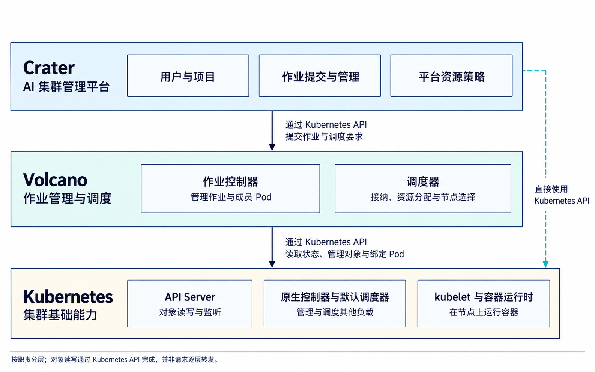
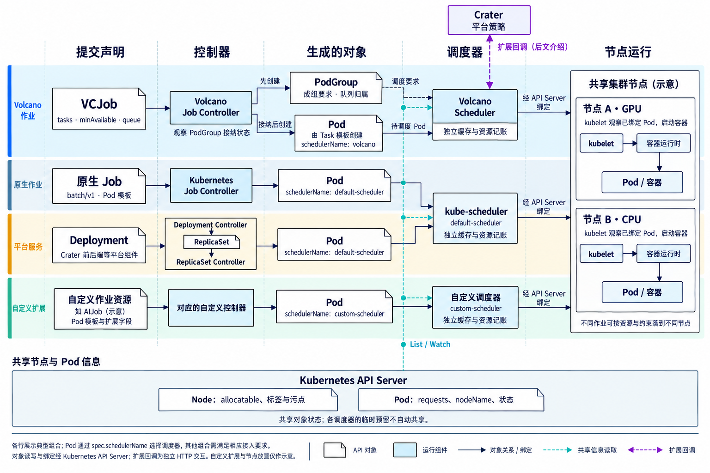
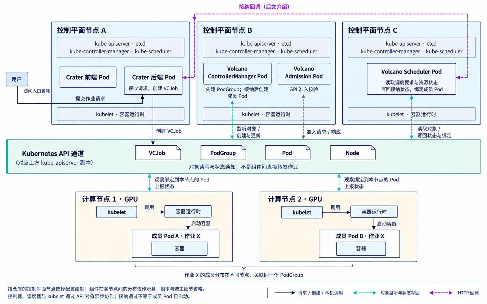
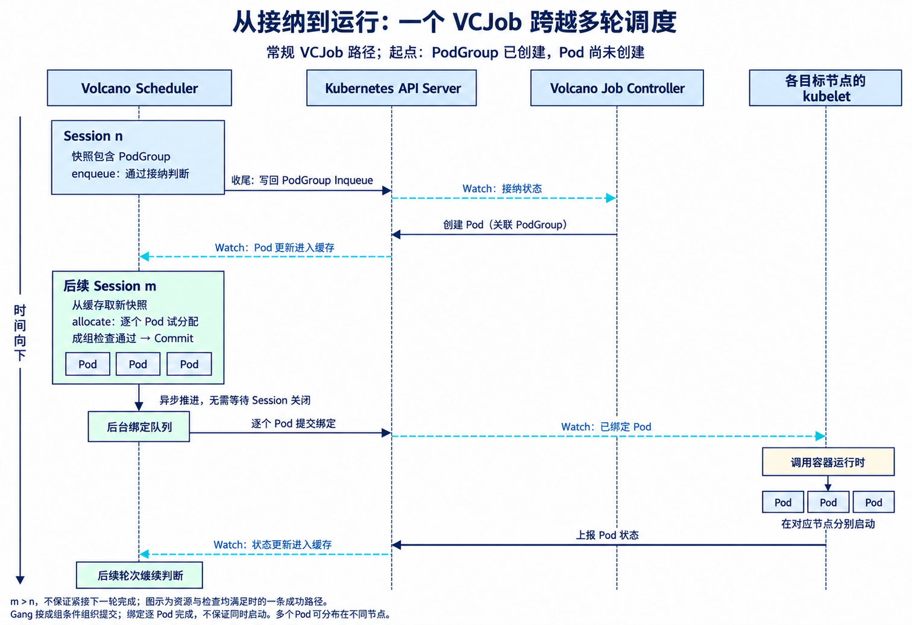
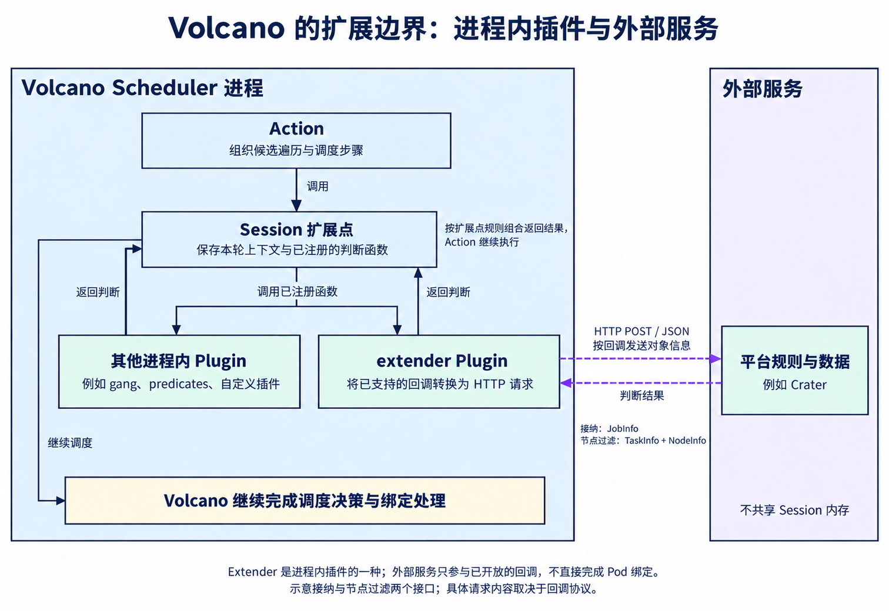

Volcano 如何接纳与调度 AI 作业

先介绍一下背景。Crater 是我们开发的一个开源 AI 集群管理平台，基于 Kubernetes，方便用户使用集群中的 GPU 等资源跑训练、推理，或者启动 Jupyter 等开发环境。

在平台设计之初，我们（其实是当时的师兄师姐）就决定基于 Volcano 做作业调度。Volcano 是建立在 Kubernetes 上的批处理与作业调度系统，负责协调作业的资源分配。Crater 的名字也是由此而来：Volcano 是“火山”，Crater 则是“火山口”。

好像这里每篇博客都要提一嘴 Crater，毕竟这个专栏基本上就是基于这个项目创建的（

三者的分工可以先看下面这张图：Crater 面向用户提供平台功能，Volcano 负责作业管理与调度，Kubernetes 提供集群基础能力。



这篇借助我们在 Crater 中使用 Volcano 的实践，介绍 Volcano 自身如何组织、接纳和调度作业，以常规 VCJob 流程为主线。Crater 如何组织平台作业，并在这套机制中接入自己的管理与接纳规则，留到下一篇展开。

实现细节以写作时的最新稳定版 [Volcano v1.15.3](https://github.com/volcano-sh/volcano/releases/tag/v1.15.3) 为准（2026 年 10 月 7 日），不以 Crater 集群部署的版本为准。涉及可选策略与功能时，会说明其生效条件。

# Volcano 如何组织作业与调度资源

Volcano 是面向 AI 训练等批处理与高性能计算场景的调度系统，负责协调作业的计算资源分配，因此需要考虑这类作业的协作特点。分布式训练通常由多个进程共同完成计算和通信；跨节点运行时，这些进程需要由多个 Pod 承载。如果只为其中一部分 Pod 分配资源，它们可能占着 GPU 等待其余 Pod；多个作业都只启动一部分时，还可能互相占用资源、都无法推进。

因此，Volcano 将成组要求纳入调度设计：既检查单个 Pod 能否获得资源，也检查整组是否满足最低要求。同时，共享集群中还有不同团队的作业竞争资源，需要确定各自的份额与分配顺序。这两层需求，分别体现在后面介绍的调度分组 PodGroup 和资源队列 Queue 中。

接下来按三步展开：

1. 先建立整体认识：组件怎样分工，作业、Pod、分组和队列怎样关联。
2. 再走过一轮调度：怎样接纳作业、分配节点，以及按配置执行回填、抢占和回收。
3. 最后看如何扩展：哪些需求可以通过配置表达，哪些需要自定义策略，以及怎样让外部平台参与调度判断。

## Volcano 与 Kubernetes 的分工

先把“作业”和实际运行程序的单位对应起来。用户提交的一次训练或数据处理，是一项完整的工作，我们称为作业；程序在容器中执行，而 Kubernetes 用 Pod 组织这些容器。一个作业可以只需要一个 Pod，也可以由多个 Pod 分工完成。

Pod 是 Kubernetes 最小的可部署单元，包含一个或多个紧密协作的容器。同一个 Pod 的容器运行在同一节点上，共享网络环境，也可以挂载同一存储卷。调度器为整个 Pod 选择节点，因此，多节点作业需要通过多个 Pod 承载程序。见 [Kubernetes Pod 文档](https://kubernetes.io/docs/concepts/workloads/pods/)。

本文将参与同一作业的 Pod 称为这项作业的“成员 Pod”，按 Pod 对象计数。一个 Pod 可以包含多个容器，也可以运行多个进程；这里的成员数量不按容器、进程或角色种类计数。

把程序装进 Pod，还没有解决整个作业怎样启动的问题：需要有人根据声明创建成员、处理失败，也需要有人协调资源，为成员选择节点，最后再由节点启动程序。这几件事分别由控制器、调度器和 kubelet 承担。Volcano 提供自己的作业控制器和调度器，可以与 Kubernetes 原生控制器和默认调度器在同一集群中共存：

- 作业控制器管理成员与生命周期：根据作业声明创建 Pod，跟踪执行结果，按规则处理完成、失败和重试。
- 调度器决定资源分配与节点落点：Volcano 判断作业能否参与分配、先考虑谁，再为成员 Pod 选择节点并提交绑定。
- 节点上的 kubelet 推进运行：绑定确定 Pod 的运行节点后，kubelet 配合容器运行时准备环境、启动容器。

这就是 Volcano 与 Kubernetes 的分工：Volcano 管理作业、协调资源分配，Kubernetes 继续提供对象存储、节点和容器运行等基础能力。官方架构图展示了它们的关系。


图片来源：[Volcano 官方架构文档](https://volcano.sh/docs/v1.13.0/home/architecture/)。

为了分别表达“作业要运行什么”“哪些成员需要一起调度”和“多个作业怎样分享资源”，Volcano 引入了 Job、PodGroup 和 Queue 三种自定义资源。它们保存声明，还需要控制器持续维护相应对象与状态。图中的 ControllerManager 就是这些控制器的管理组件，通过 API Server 监听、更新对象；其中 Job CM、PodGroup CM 和 Queue CM 的分工如下，具体对象关系会在后面展开：

| 图中控制器 | 主要职责 |
| --- | --- |
| Job CM | 管理 Volcano Job：根据作业声明维护 PodGroup 和成员 Pod，跟踪作业状态，按策略处理完成、失败与重试。 |
| PodGroup CM | 为指定使用 Volcano、但尚未关联 PodGroup 的普通 Pod 补建分组并写入关联信息，使这类负载也能进入 Volcano 的调度流程。VCJob 的 PodGroup 则由 Job 控制器维护。 |
| Queue CM | 管理队列的开启、关闭等状态，并结合队列内的 PodGroup 情况推进状态变化；使用层级队列时，还协调父子队列的开关状态。 |

这些控制器维护作业及其调度声明，Scheduler 再依据声明和集群资源情况执行接纳、资源分配与节点选择。尤其要区分：PodGroup 控制器不会替成员选择节点，Queue 控制器也不负责计算每轮应给各作业分配多少资源。以上职责见 [Volcano 控制器实现](https://github.com/volcano-sh/volcano/tree/v1.15.3/pkg/controllers)，具体对象关系在下一节展开。

图中的 Admission 参与对象创建、修改时的默认值填充与 API 校验，vcctl 则是命令行客户端。这里有两个容易混淆的环节：

- API 准入：处理对象的创建、修改请求，检查请求能否被接受。
- 调度接纳：处理已创建的作业，判断它现在能否参与资源分配。

因此，提交成功、通过接纳、获得节点和容器启动，是不同的时刻。

## 作业、成员与调度分组

一次训练通常有明确的完成目标。某个 Pod 退出后，可能意味着工作已经完成，也可能需要重试；分布式训练还要结合其他成员判断整个作业的结果。因此，除了承载程序的 Pod，还需要一个上层对象声明完成条件与重试规则，由控制器持续推进。

Kubernetes 原生 Job 就用于表达这类以完成为目标的工作：用户提供 Pod 模板，声明并行度、完成数量和重试要求，Job Controller 据此创建 Pod、跟踪结果，直到满足完成或失败条件。Pod 模板是创建成员时使用的配置，包含容器镜像、启动命令和资源需求等。见 [Kubernetes Job 文档](https://kubernetes.io/docs/concepts/workloads/controllers/job/)。

分布式作业还可能包含不同角色，各自运行不同程序、需要不同数量的副本。Volcano 因此提供了自己的 Job 资源，简称 VCJob，通过其中的 Task 定义组织这些角色。每个 Task 保存一个角色的名称、Pod 模板和副本数，Volcano Job Controller 再据此管理成员 Pod。

例如，一个协调角色和一个具有三个副本的计算角色，对应两个 Task 定义、四个 Pod。下面的 Pod 名称仅用于示意，箭头表示控制器根据模板创建副本。

```text
VCJob：整个作业的声明
└── spec.tasks：作业中的角色定义
    ├── master：replicas = 1  →  Pod master-0
    └── worker：replicas = 3  →  Pod worker-0、worker-1、worker-2
```

Task 是 VCJob 的 `spec.tasks` 列表中的一项，不是独立创建的 API 资源；列表顺序也不自动表示角色的执行依赖。原生 Job 直接使用一个 Pod 模板，没有这份角色列表。两种 Job 的 API 分别是 `batch/v1` 和 `batch.volcano.sh/v1alpha1`，由各自的控制器处理。相关字段见 [Volcano Job 文档](https://volcano.sh/docs/concepts/volcanojob/)。

到这里，作业的内容和成员已经有了表达方式。但要把相互依赖的成员作为一个整体调度，调度器还需要知道哪些 Pod 属于同一组，以及这组成员最低需要多少 Pod 和资源。为此，Volcano 引入了 PodGroup（调度分组）这一概念，并将它定义为独立的自定义资源，用来声明成组调度要求。后文的 Gang Scheduling（成组调度），就是围绕这些最低要求组织分配、避免只提交无法满足要求的部分 Pod。将调度要求从 VCJob 中独立出来，也让其他计算框架能够保留自己的作业控制器，通过关联 Volcano 的 PodGroup 接入成组调度。

在本文讨论的常规 VCJob 流程中，一个 VCJob 对应一个 PodGroup，所有 Task 生成的成员 Pod 都关联到这个分组。两者都从整个作业的粒度描述问题：VCJob 声明运行内容与生命周期策略，PodGroup 声明这批成员的成组调度要求，并不是每个 Task 各有一个 PodGroup。

Job Controller 根据作业声明创建和维护这个 PodGroup，并在创建成员 Pod 时标明其分组归属。调度器据此关联成员，读取整组要求。PodGroup 表达调度关系，成员 Pod 仍由作业控制器创建。 PodGroup 与其成员位于同一命名空间。

有了分组归属，调度器还需要知道怎样才算达到最低运行规模。只数 Pod 不够，因为不同成员的资源需求可能不同；只看资源总量也不够，因为资源足够时，所需成员仍可能没有齐备。因此，PodGroup 分别声明成员数量与资源数量的最低要求：

| PodGroup 字段 | 表达的要求 | 在 VCJob 流程中的来源 |
| --- | --- | --- |
| `spec.minMember` | 整组最低需要多少个成员，按 Pod 计数。 | VCJob 的 `spec.minAvailable`。 |
| `spec.minResources` | 接纳时使用的整组最低资源需求，按 CPU、内存等资源分别声明。 | 控制器结合成员声明计算。 |
| `spec.minTaskMember` | 按角色记录最低 Pod 数量，供适用的角色级检查使用。 | 控制器根据 VCJob 各 Task 的 `minAvailable` 等配置生成。 |

字段与映射关系见 [PodGroup 文档](https://volcano.sh/docs/concepts/podgroup/)与 [创建实现](https://github.com/volcano-sh/volcano/blob/v1.15.3/pkg/controllers/job/job_controller_actions.go)。

这些最低要求是调度的判断依据，声明后并不立即获得资源。调度器还要执行接纳和分配，检查是否能够满足成组条件；满足最低成员要求，也不意味着全部副本都已获分配，或所有容器会同时启动。

前面例子中的四个 Pod 关联到同一个 PodGroup：

```text
同一 VCJob 对应的 PodGroup：保存这组成员的调度要求
└── 通过成员 Pod 上的分组注解关联：
    master-0、worker-0、worker-1、worker-2
```

所以，Task 定义包含在 VCJob 中，Pod 是根据定义创建的独立对象，PodGroup 则关联这些 Pod，而不包含 Task 定义或 Pod 模板。在这个例子中，PodGroup 关联的是四个 Pod，不是两个 Task；它与成员 Pod 都由 Job Controller 管理，并通过 `ownerReferences` 记录所属 VCJob。分组关联和对象归属表达的是不同关系。见 [成员 Pod 的创建实现](https://github.com/volcano-sh/volcano/blob/v1.15.3/pkg/controllers/job/job_controller_util.go)。

> 有些作业还需要把成员划成更小的协作组，分别约束组内调度和网络拓扑。此时可以通过 Task 的 `partitionPolicy` 声明分组规则，控制器将它们写入同一个 PodGroup 的 `subGroupPolicy`；这些子组仍属于原来的 PodGroup。

前面提到，Volcano 的控制器和调度器可以与 Kubernetes 原生组件共存。明确了对象关系后，就可以进一步说明：一个作业由哪个控制器管理，它的成员 Pod 又交给哪个调度器。

作业资源的类型由 `apiVersion` 和 `kind` 标识，控制器主动监听自己负责的类型：默认由 Kubernetes Job Controller 处理原生 Job，由 Volcano Job Controller 处理 VCJob。控制器必须实现相应资源的管理逻辑，API Server 不会把作业主动派发给某个控制器；修改 Pod 的调度器名称，也不会让这两种控制器互相替代。

调度器则在 Pod 层选择，由最终生成的 Pod 的 `spec.schedulerName` 指定。因此，作业控制器与 Pod 调度器可以组合使用，常见路径如下：

| 作业资源 | 管理作业的控制器 | Pod 使用的调度器 |
| --- | --- | --- |
| 原生 Job | Kubernetes Job Controller | `default-scheduler` |
| 原生 Job | Kubernetes Job Controller | `volcano` |
| VCJob | Volcano Job Controller | `volcano` |
| 自定义作业资源，如 AIJob | 对应的自定义控制器 | 按接入要求选择，例如自定义调度器 |

这份选择最终都要落到 Pod 的 `spec.schedulerName`，但在作业声明中的填写位置不同：

- 原生 Job：在 `spec.template.spec.schedulerName` 中指定。
- VCJob：通常设置作业级的 `spec.schedulerName`，控制器在成员模板未指定时将它填入 Pod。

修改这个字段只改变谁来调度 Pod，不会让原生控制器接管 VCJob，也不会让原生 Job 自动获得 VCJob 的全部能力。原生 Job 要使用 Volcano 的成组调度，仍需关联其 PodGroup，并声明所需的最低规模；自动补建的分组不一定表达了用户真正需要的整组要求。见 [Kubernetes 多调度器机制](https://kubernetes.io/docs/tasks/extend-kubernetes/configure-multiple-schedulers/)与上述成员创建实现。

在 Crater 中，常规用户作业使用 VCJob 和 Volcano Scheduler，前后端等平台组件则使用原生 Deployment 和默认调度器。我们做调度算法研究时，也使用过其他类型的作业和调度器。这些实践说明，同一集群可以容纳多种组合；下面仍以 Volcano 管理的作业为主线。

选中的调度器为 Pod 找到节点后，通过 API Server 提交绑定，结果体现在 Pod 的 `spec.nodeName` 中，再由目标节点的 kubelet 推进运行。这两个字段分别对应选择与结果：

```text
Pod.spec.schedulerName  →  谁来选择节点
Pod.spec.nodeName       →  已分配到哪个节点
```

最终绑定的是 Pod 与节点，而不是把整个 Job 或 PodGroup 绑定到一个节点。见 [Kubernetes 调度流程](https://kubernetes.io/docs/concepts/scheduling-eviction/kube-scheduler/)。

下面将这些关系放在一张图中。上方的 VCJob 路径是本文的重点，其余路径用于对照控制器与调度器的分工。



图中各行展示典型组合，实际流程依靠对象状态变化推进：Volcano Job Controller 先创建 PodGroup，观察到接纳状态变化后再创建成员 Pod，随后由 Volcano Scheduler 为 Pod 分配节点。原生 Job 与 Deployment 的 Pod 在图中交给同一个默认调度器，自定义作业则展示另一种扩展路径。各类 Pod 仍通过 `spec.schedulerName` 选择调度器，其他组合需满足相应接入要求；自定义扩展与节点放置仅作示意。

再从节点视角看，Volcano 的控制器和调度器本身也是运行在节点上的 Pod。下图借用 Crater 的部署方式，将它们放在控制平面节点上；这是一种可行布局，具体落点仅作示意。



Volcano 通过 API Server 更新对象与绑定结果，各节点的 kubelet 据此启动分配给自己的 Pod 中的容器。同一作业的成员可以分布在多个节点，仍关联同一个 PodGroup。图中的 API 通道代表对 kube-apiserver 的访问；Crater 回调只标出平台扩展入口，具体接入留到下一篇。

沿着这个流程观察进度时，还要区分“整项工作完成到哪一步”和“某个成员运行到哪一步”。一个成员开始运行，并不代表整组已经就绪；整组获得节点，也不代表训练已经完成。因此，状态分别记录在对应对象上：

| 状态属于谁 | 记录什么 |
| --- | --- |
| VCJob | 整个作业的执行生命周期。 |
| PodGroup | 成组接纳与调度进度。 |
| Pod | 具体实例的运行情况。 |

后面遇到 Pending、Inqueue、Running 时，会结合对应对象解释，避免把“已获分配”和“已经运行”混为一谈。

## 队列与资源核算

PodGroup 解决了一个作业内部怎样成组调度的问题。但实际集群通常由多个团队共享，每个团队又有多个用户和作业。团队之间的资源权益也未必相同：有的分配了更多 GPU 额度，有的业务需要优先保障。如果只按单个作业排序，一个提交大量作业的团队就可能持续占用资源，很难落实团队之间约定的分配规则。

因此，需要先把同一团队或业务的作业归到一起，汇总它们的资源占用，再在组与组之间分配。Volcano 用 Queue 表达这层资源归属与分配政策。 平台可以让同一团队的作业使用同一个 Queue，也可以按业务划分；团队与队列的对应关系由平台或提交方建立。

Queue 是集群级的自定义资源，API 为 `scheduling.volcano.sh/v1beta1`，可以关联多个命名空间中的 PodGroup。VCJob 的 `spec.queue` 会由控制器写入 PodGroup 的 `spec.queue`，确定这组成员的资源归属：

```text
VCJob.spec.queue → PodGroup.spec.queue → Queue 的名称
                                         ↑
                           同一队列汇总多个作业的资源分配
```

确定归属之后，首先要表达每个团队“可以拿多少资源”。这里有两种不同的需求：资源紧张时，各团队应当获得约定的份额；资源空闲时，又希望允许有需求的团队多用一些，避免设备闲置。因此，应得份额和最多可用量需要分别声明。份额既可以直接给出资源数量，也可以采用按相对权重计算的方式：

| Queue 字段 | 含义与边界 |
| --- | --- |
| `spec.capability` | 资源上限：限制队列可获分配的资源量，分别声明 CPU、内存、GPU 等维度；有额度不代表节点上一定放得下。 |
| `spec.deserved` | 应得份额：显式声明队列应享有的资源份额。空闲份额可以被其他队列借用，需要时再按回收规则取回；它不是硬上限。 |
| `spec.weight` | 相对权重：采用按权重分配的策略时，用于结合需求和资源上限计算队列的应得份额；权重不是固定的资源数量。 |

允许共享空闲份额后，还需要约定资源如何收回。有些业务需要留出不供其他团队借用的额度；可以借用的部分，也需要明确占用它的队列是否允许被跨队列回收。此外，资源竞争时还可能需要优先考虑某些业务。这些要求由另一组字段表达：

| Queue 字段 | 含义与边界 |
| --- | --- |
| `spec.guarantee.resource` | 保留量：在支持它的资源策略中，为本队列保留、不供其他队列借用的额度。它不直接圈定节点，也不保证作业立即启动。 |
| `spec.reclaimable` | 能否被跨队列回收：控制该队列是否允许成为其他队列回收资源的对象，不代表其中的 Pod 不会因其他原因被终止。 |
| `spec.priority` | 队列优先级：供支持该字段的策略比较队列顺序，数值更高者先被考虑；它与单个作业或 Pod 的优先级不同。 |

如果资源还要先分配到部门、再分到团队，就可以通过 `spec.parent` 建立父子队列，将政策按层次组织起来。这些字段共同描述资源权益，调度器再根据启用的策略执行，并不是填入字段就一定采用某种算法。字段定义见 [Queue API](https://github.com/volcano-sh/volcano/blob/v1.15.3/staging/src/volcano.sh/apis/pkg/apis/scheduling/v1beta1/types.go)；具体怎样计算份额、检查上限和执行回收，会在后面的调度过程中展开。

到这里，Queue 表达的是一组作业共享的资源权益。它并不天然要求先进先出，也不等于独占某组节点；政策上允许分配之后，还要检查实际资源是否可用。同一笔分配始终需要检查两个层面：

- 队列层面：按照份额、上限等政策，还能不能继续获得资源？
- 节点层面：有没有满足资源容量、亲和性等条件的具体节点？

队列尚有额度，集群也可能找不到合适节点；节点空闲，队列政策也可能限制继续分配。

要把队列政策与节点容量联系起来，还需要统一“占用了多少资源”的计算口径。训练中的实际利用率会波动，但一时没有计算，不代表已经交还调度器分配的资源。因此，这两类核算主要依据 Pod 的资源申请量，需要与运行时上限、监控用量区分：

| 信息 | 表达什么 |
| --- | --- |
| Pod 的 `requests` | 声明需要多少资源，是常规 CPU、内存及扩展资源调度的记账依据。 |
| CPU、内存的 `limits` | 约束容器运行时使用上限，不等于调度时预留了同样多的资源。 |
| 监控中的实际用量 | 此刻实际消耗的资源，降低后不会自动撤销已有分配。 |
| Node 的 `status.allocatable` | 节点可供 Pod 使用的容量，不是扣除已有分配后的剩余量。 |

例如，获得整卡 GPU 的 Pod 即使暂时不计算，仍持有这份资源。节点的剩余量需要在可分配容量上扣除已计入占用的资源请求，并按具体节点、具体资源分别计算，不能用集群总空闲量代替。队列则汇总归属于自己的分配；队列额度约束的是调度分配，不是所有容器实际用量的合计运行时上限。见 [Kubernetes 资源管理文档](https://kubernetes.io/docs/concepts/configuration/manage-resources-containers/)。

前面还提到，同一集群可以运行多个调度器。节点容量会被它们调度的 Pod 共同占用，因此 Volcano 判断节点余量时，也要统计其管理节点上由其他调度器绑定的 Pod。它通过 API Server 监听 Node 和 Pod 获取这些信息，但共享信息来源与共享调度过程中的记账是两回事：

```text
共享的对象信息：Kubernetes API 中的 Node、已绑定的 Pod 等
各自维护的状态：调度器缓存、当前调度过程中的临时预留
```

因此，共享集群信息不等于共享一份实时同步的资源账本，临时预留也不会自动通知其他调度器。多个调度器并发使用同一批节点时，仍可能竞争同一份资源，不能仅凭共享 API 信息就假定它们已经协调好了分配。

有了这些对象和核算关系，接下来就能看调度器怎样把声明转化成实际决定：先判断作业能否参与分配，再按队列和作业规则选择成员，为 Pod 寻找节点，并检查成组要求。份额比较、借用和回收会放在对应步骤中展开。

# 一轮 Volcano 调度如何进行

一轮调度的目标，是基于当前看到的集群状态，在策略允许的范围内尽量推进作业的接纳和资源分配，而不是只选出一个最优先的作业。 调度器会持续处理本轮候选，尝试接纳能够通过检查的作业，并为满足条件的 Pod 分配节点。因此，一轮可以推进多个作业、分配多个 Pod；优先级决定先考虑谁，不意味着处理完第一个作业就结束本轮。

这里的“尽量推进”也有边界：算法按既定顺序检查候选，受队列政策、节点条件和成组要求约束，并不穷举所有摆放组合来求全局最优解。当前尝试没有成功，也不等于数学上不存在可行方案。

## 调度周期与策略的组织

Volcano 的调度器持续监听 Kubernetes 对象，把观察到的节点、Pod、PodGroup 和 Queue 等信息维护在缓存中。但一轮调度需要基于一份确定的输入连续做出决定，因此会先从缓存取得快照，再建立本轮的 Session。

Session 是调度器进程内的一次调度上下文，从本轮开始时创建，到本轮收尾后释放。它不是 Kubernetes API 资源，也不对应某一个作业；本轮的多个作业在同一个 Session 中竞争资源，各个调度步骤也共用这份上下文。

Session 主要包含：

- 作业与 Pod：本轮看到的作业、Pod、队列归属、资源请求和成组要求。
- 节点与资源：候选节点、可分配容量、已有占用，以及用于本轮计算的剩余量和预期释放量。
- 队列政策与账目：各队列的分配约束，以及策略维护的已分配量、已接纳需求等。
- 策略与判断函数：本轮启用的策略，以及排序、接纳、节点筛选和成组检查等规则。

固定下来的是本轮的基础输入，资源账目和调度状态仍会随本轮决策变化。 可以把边界分成三类：

| 信息类别 | 在本轮中怎样使用 |
| --- | --- |
| 基础快照与配置 | 本轮选用的作业、节点、队列信息和策略配置确定后，不会因外部更新而自动重新加载；节点可分配总容量等基础量也据此计算。 |
| 本轮决策与记账 | 接纳、试分配和撤销会改变内部状态及资源账目。后一次判断必须看到前一次操作的影响，撤销尝试时也要恢复对应账目。 |
| 外部对象变化 | 新创建的 Pod、节点资源释放等变化继续进入缓存，通过后续轮次的新快照纳入调度。 |

例如，前一个 Pod 试分配成功后，后一个 Pod 要使用扣除这次分配后的剩余量；但控制器刚创建的新 Pod，不会直接插入本轮的候选集合。这就是“基于快照计算”与“在本轮持续更新账目”的区别。

这份快照也不意味着锁住整个集群：存储、设备等插件可能访问其他缓存或 API，后台绑定仍可能成功或失败。Session 固定的是调度的主要工作集，不是把所有外部信息原子冻结。相关实现见 [Session 初始化与收尾](https://github.com/volcano-sh/volcano/blob/v1.15.3/pkg/scheduler/framework/session.go)和 [缓存快照](https://github.com/volcano-sh/volcano/blob/v1.15.3/pkg/scheduler/cache/cache.go)。

有了这个上下文，可以用下面的伪代码概括一轮调度。它保留执行顺序与循环边界，省略日志、指标等细节；后面会沿用其中的步骤编号：

```text
后台持续运行：监听 Kubernetes 对象，更新调度器缓存

每当开始新一轮调度：
    本轮配置 = 读取当前调度配置
    Session = 打开会话(缓存快照, 本轮配置)                 // ①
              初始化本轮策略与资源账本

    try:
        for Action in 本轮配置.actions（保持配置顺序）:
            执行 Action(Session)
            // 若为 enqueue：遍历本轮待接纳候选           // ②
            // 若为 allocate：循环尝试队列、作业及 Pod 分配 // ③
            // 若为 backfill 或已配置的抢占、回收：
            //     执行对应的补充分配或占用调整            // ④
    finally:
        关闭 Session                                    // ⑤
        执行策略收尾，更新对象状态，释放本轮上下文

后续轮次：重新取快照、重新打开 Session
后台绑定与控制器响应：独立推进，结果经对象变化反馈到缓存
```

外层的 `for` 每次执行一个完整的 Action；②、③内部还有各自处理候选的循环，并不是这层循环每次只处理一个作业。编号用于组织讲解，实际执行顺序由 `actions` 列表决定。v1.15.3 内置默认配置是：

```yaml
actions: "enqueue, allocate, backfill"
```

因此，默认的一轮会依次执行②、③和④中的 `backfill`，随后进入⑤；抢占与回收需要另外启用，并在配置指定的位置执行。调度器不会因为某次分配失败，就自动调用所有其他 Action，也不会在它们执行完后自动重新跑一遍 `enqueue` 或 `allocate`。主循环见 [Scheduler 实现](https://github.com/volcano-sh/volcano/blob/v1.15.3/pkg/scheduler/scheduler.go)与 [默认配置](https://github.com/volcano-sh/volcano/blob/v1.15.3/pkg/scheduler/util.go)。

Action 组织步骤，Plugin 提供判断规则。 例如，`allocate` 负责组织“选择队列、选择作业、筛选节点、尝试分配”的循环，但具体采用什么排序方式、怎样判断资源够不够，由插件在 Session 打开时注册的函数决定。

下面列出的是 Volcano 调度插件（Plugin）的名称及其职责。这些名称对应调度器配置中 `tiers[].plugins[].name` 的值，例如 `name: gang` 表示启用 Gang 插件；只有按配置启用相应判断后，插件才会参与对应步骤。

| 调度过程需要回答的问题 | 插件名称（Plugin） | 插件提供的判断 |
| --- | --- | --- |
| 哪个作业或 Pod 先被考虑？ | `priority`、`gang` | `priority` 比较优先级；`gang` 根据成组就绪情况参与作业与子组排序。 |
| 不同作业的多种资源占用怎样比较？ | `drf` | 比较主导资源份额，参与作业排序等判断。 |
| 队列还能获得多少资源？ | `proportion`、`capacity` | `proportion` 按权重、需求和上限计算份额；`capacity` 依据显式声明的份额管理分配，并可处理层级队列。 |
| 一个 Pod 能不能放到某个节点？ | `predicates` | 检查节点约束、资源及相关条件。 |
| 多个节点都合适时选哪个？ | `nodeorder` | 对候选节点评分。 |
| 当前分配是否满足整组要求？ | `gang` | 检查作业、角色及配置的子组要求。 |

插件也不是各自完整跑一遍调度。一次 Action 会在不同位置调用不同的判断函数；一个插件可以参与多个位置。配置中的 `tiers` 将插件分层，具体组合方式取决于判断类型。例如，排序通常采用按配置顺序得到的第一个非零比较结果，接纳则采用后面②中介绍的分层投票规则。不能把插件列表理解成另一份固定的执行流水线。

进入算法之前，需要把 Kubernetes 中的资源对象、调度器内部的表示、存放候选的数据结构 分开。它们不是可以随意互换的名称：

| Kubernetes 中的对象或声明 | 调度器内部的表示 | 本文伪代码中的变量 |
| --- | --- | --- |
| 一个 Queue 资源，即前文的资源队列 | `QueueInfo`：保存该 Queue 的信息，供调度器使用。 | `queueInfo` |
| 一个 PodGroup 及其关联 Pod，构成一个调度作业 | `JobInfo`：汇总整组调度要求及其 Pod 的信息。 | `jobInfo` |
| 一个具体 Pod | `TaskInfo`：保存该 Pod 的资源请求、节点及内部调度状态。 | `taskInfo` |
| 一个 Node | `NodeInfo`：保存节点信息及调度器维护的资源账目。 | `nodeInfo` |
| VCJob 的一个 `spec.tasks` 项 | 这是角色定义，可生成多个 Pod，因而对应多个 `TaskInfo`。 | 不作为单个待分配对象。 |

因此，一个调度作业对应一个 `JobInfo`，其中可以有多个 `TaskInfo`；每个 `TaskInfo` 对应一个 Pod。 VCJob 的 Task 角色定义也不等于 `TaskInfo`。常规 VCJob 通过对应的 PodGroup 进入这套内部表示，其他作业框架也可以通过 PodGroup 接入，所以 `JobInfo` 并不限定表示 VCJob 资源。

另一个重名来自“队列”：Queue 是声明资源政策的 API 资源，优先队列则是算法用来排列候选的内存数据结构。 后者可以存放 `QueueInfo`，也可以存放 `JobInfo` 或 `TaskInfo`。为避免混淆，下文把这些算法容器分别称为“Queue 候选集合”“作业候选集合”和“Pod 候选集合”；从中取出或放回一个元素，只改变本轮的处理顺序，不是创建、删除 Queue 资源，也不是更改作业的队列归属。

正文仍用“作业”和“Pod”解释调度行为；伪代码统一用上表中的变量名标明内部对象。`Allocated`、`Pipelined`、`Binding` 等属于 `TaskInfo` 的内部调度状态，不是 Kubernetes Pod 的 `status.phase`。

## enqueue：判断作业能否参与资源分配

步骤②的目标，是把本轮待接纳候选按顺序检查一遍，让能够通过接纳判断的作业进入资源分配阶段。 接纳一个作业后，Action 会继续考虑其他候选；优先级靠前的作业被拒绝，也不会让当前实现直接停止检查整个队列。

先区分两种容易混淆的“入队”：作业通过 `spec.queue` 关联 Queue，确定的是资源归属；`enqueue` 推进 PodGroup 到 `Inqueue`，确定的是它已经通过当前接纳判断。一个 PodGroup 可以早已归属某个 Queue，却仍处于 `Pending`，等待接纳。

这一过程可以拆成四步：

1. 整理候选。 从 Session 中取出 PodGroup 阶段为空或 `Pending` 的作业，按所属 Queue 分组，建立存放 `QueueInfo` 的 Queue 候选集合，以及每个 Queue 对应的 `JobInfo` 候选集合。没有 PodGroup 或所属 Queue 不存在的作业，在生成快照时就会被排除。
2. 选择下一个作业。 先从 Queue 候选集合取出一个 `QueueInfo`，再从它对应的作业候选集合取出当前优先的 `JobInfo`。
3. 判断并更新状态。 满足接纳条件时，调用入队通知函数，并把 Session 中对应 PodGroup 的阶段改为 `Inqueue`；不满足时保持待接纳状态。
4. 继续遍历。 把 `QueueInfo` 放回 Queue 候选集合，继续处理其他作业，直到本轮候选耗尽。刚刚被拒绝的作业不会在这次 `enqueue` 中反复重试。

这里尚不要求所有 Pod 已经存在。尤其在常规 VCJob 流程中，Job Controller 正是在观察到 PodGroup 接纳状态推进后，才继续创建 Pod。因此，`enqueue` 不会先做“Pod 是否已齐”的 Gang 有效性检查；那属于③分配前的检查。

接纳主要判断当前政策是否允许这个作业继续推进，并不为它逐个寻找节点。 以资源相关插件为例：

| 检查层面 | 在判断什么 |
| --- | --- |
| 队列资源政策 | 队列是否开启，以及结合已分配量、已接纳作业的资源需求和本作业最低需求，是否仍满足有效额度。层级策略还会检查祖先队列。 |
| 集群接纳规模 | 例如 `overcommit` 根据集群容量、已用量和配置的接纳倍率，限制进入分配阶段的最低资源需求总量。 |
| 扩展政策 | 配置了接纳扩展时，可以加入平台提供的额外判断；具体接入留到后文。 |

这些判断通常使用 PodGroup 的 `minResources`，而不是预先为全部副本找到位置。接纳倍率允许一定数量的需求提前进入分配阶段，也不意味着后面可以把超出节点容量的资源直接绑定出去。

在实现上，这些规则通过 `JobEnqueueable` 汇总：按 `tiers` 顺序检查，同一层中出现拒绝就返回拒绝；该层没有拒绝且至少有一个明确允许，就返回允许，不再继续下一层；全部检查都未给出拒绝或明确允许时，最终默认允许。因此，扩展策略放在哪一层也会影响它是否被执行。

还有一个明确的特殊分支：PodGroup 的 `minResources` 为 `nil` 时，`enqueue` 会跳过这组接纳投票，直接走入队通知和状态更新。 这里指的是字段未提供，不是资源数量恰好等于零。常规 VCJob 由控制器计算这个字段，接入其他类型作业时则需要留意这个边界。实现见 [enqueue](https://github.com/volcano-sh/volcano/blob/v1.15.3/pkg/scheduler/actions/enqueue/enqueue.go)与 [Session 接纳函数](https://github.com/volcano-sh/volcano/blob/v1.15.3/pkg/scheduler/framework/session_plugins.go)。

每次接纳还会影响本轮的资源账目。例如，资源插件会计入已接纳但尚未完成分配的需求，后面的作业要依据更新后的账目判断，不能都拿同一份额度各自通过检查。不过，这份接纳记账仍不等于占住了具体节点。

所以，②结束时得到的是本轮推进到 `Inqueue` 的一批作业。它们获得了继续分配的资格；能否满足节点条件、能否凑齐成组要求，还要交给③。

## allocate：选择作业并为 Pod 分配节点

步骤③的目标，是在本轮候选和策略范围内持续尝试分配，推进能够找到可用资源的作业与 Pod。 它既处理刚接纳且 Pod 已出现在快照中的作业，也可以继续处理已进入运行阶段、仍有 Pod 等待分配的作业。

从整体上看，调度器先选择 Queue，再选中其中一个作业，尝试为这个作业分配资源。后续选择 Pod，是把这个已选作业的分配方案逐步落实到具体 Pod 和节点上。作业表达成组要求，实际申请资源、匹配节点和完成绑定的单位则是 Pod，因此算法需要逐个尝试它的待分配 Pod，累计分配结果并检查成组条件。对于已经满足最低规模的作业，也可以继续分配剩余 Pod。

先看完整循环，再展开各步判断。③-A、③-B负责选择队列与作业；选中作业后，在它内部反复执行③-C至③-E，逐个尝试 Pod，用同一个 Statement 记录本次可撤销的试分配，最后在③-F决定提交、等待资源释放或撤销。下面以未配置额外子组和硬性网络拓扑约束、Pod 有资源请求的常规路径为例，省略错误处理细节：

```text
整理通过前置检查的候选：
    Queue 候选集合：存放 QueueInfo，按队列规则排序
    作业候选表：每个 Queue 对应一个 JobInfo 候选集合
    Pod 候选表：每个调度作业对应一个 TaskInfo 候选集合

while Queue 候选集合不为空:
    queueInfo = 从 Queue 候选集合取出当前优先的元素       // ③-A
    jobCandidates = 作业候选表[queueInfo.UID]
    if 队列级 Overused 检查要求跳过该 Queue，或 jobCandidates 为空:
        continue
    jobInfo = 从 jobCandidates 取出当前优先的元素         // ③-B
    podCandidates = Pod 候选表[jobInfo.UID]

    结果 = 尝试为作业分配资源(queueInfo, jobInfo, podCandidates, Session)
    if 结果为已提交，且 podCandidates 仍不为空:
        将 jobInfo 放回 jobCandidates
    将 queueInfo 放回 Queue 候选集合，按更新后的账目继续比较

尝试为作业分配资源(queueInfo, jobInfo, podCandidates, Session):
    statement = 新建操作记录(Session)  // 累计这个作业本次尝试的分配

    while podCandidates 不为空:  // 始终从当前作业中选择 Pod
        taskInfo = 从 podCandidates 取出当前优先的元素     // ③-C
        if queueInfo 对应的队列不允许为这个 Pod 继续分配:
            continue

        nodeInfo = 过滤并选择节点(taskInfo, Session)      // ③-D
        if 没有合适节点:
            记录失败原因
            if 继续分配判断认为已无法满足最低要求:     // NeedContinueAllocating
                break
            continue

        if nodeInfo 当前空闲资源足够:                   // ③-E
            statement.Allocate(taskInfo, nodeInfo)
        else if nodeInfo 预期可用资源足够:
            statement.Pipeline(taskInfo, nodeInfo)
        // 操作成功后，本轮节点与队列账目立即反映这次尝试

        if jobInfo 当前已满足成组就绪条件:
            break

    if jobInfo 当前已满足成组就绪条件:                   // ③-F
        statement.Commit()    // 将分配交给绑定处理，不等待容器启动
        return 已提交
    else if 计入等待释放的计划后满足成组条件:
        保留本轮计划，暂不提交这份未就绪方案
        return 等待释放
    else:
        statement.Discard()   // 撤销本次尝试，并恢复对应账目
        return 本次尝试失败
```

内层循环在同一个作业内累计尝试，外层循环持续选择队列与作业。内层的 `break` 只结束当前这次组内尝试，之后仍要判断提交、等待还是撤销；它不会直接结束整个 `allocate`。一次尝试失败也只撤销自己的 Statement，不会回滚这个作业或其他作业已经提交的分配。

`allocate` 首先整理候选。配置了 `enqueue` 时，PodGroup 仍为 `Pending` 的作业会被跳过；随后检查 `JobValid`、队列是否存在，以及有关拓扑等条件。启用 `gang` 时，`JobValid` 会检查当前有效 Pod 数量能否满足整组、角色及子组要求。有效 Pod 数量尚不足以满足这些最低要求的作业，会留待后续轮次。

Pod 本身也可能有调度门控：Pod 的 `spec.schedulingGates` 尚未清空时，不能直接进入绑定。v1.15.3 可选的队列门控功能会在额度允许后异步解除相应门控，待更新进入后续快照再继续分配；该功能默认关闭，不影响本文的常规 VCJob 主线。

> 如果没有配置 `enqueue`，`allocate` 会将待接纳 PodGroup 推进为 `Inqueue`，避免它永远被挡在分配阶段。这只是省略接纳 Action 时的替代路径，不代表已经执行了②的接纳检查。本文继续按包含 `enqueue` 的流程说明。

**③-A至③-C：Queue、Job、Pod 的选择对照**

这三层选择是嵌套关系：先选 Queue，再选其中的作业，最后在该作业内逐个尝试 Pod。“选择 Pod”不是又独立选出一个调度目标，而是在落实已经选中的作业的分配方案。

三个候选集合都用优先队列实现，底层是堆，由各自的比较器决定每次取出谁。下面按本文采用的内置默认插件配置对照说明；排序规则从前往后比较，只有前面的规则无法区分，才使用后面的规则。

| 对比项 | ③-A：选择 Queue | ③-B：选择 Job | ③-C：选择 Pod，落实已选作业的分配方案 |
| --- | --- | --- | --- |
| 核心目的 | 决定哪个资源队列先获得分配机会。 | 决定选中 Queue 内，哪个作业先尝试分配。 | 落实③-B已经选中的作业的分配方案：按顺序为它的待分配 Pod 寻找节点，累计结果并检查作业的成组条件，而不是重新选择独立的调度目标。 |
| 候选范围 | 本轮有候选作业的 Queue。 | 仅限选中 Queue 的候选作业。 | 仅限选中作业的待分配 Pod。 |
| 优先队列中存放什么 | `QueueInfo`：对应一个 Queue 资源。 | `JobInfo`：对应一个 PodGroup 及其关联 Pod 构成的调度作业。 | `TaskInfo`：对应一个具体 Pod，不是 VCJob 中的 Task 角色定义。 |
| Session 比较器 | `QueueOrderFn` | `JobOrderFn` | `TaskOrderFn` |
| 默认排序规则 | • 先由 `proportion` 比较 Queue 的 `spec.priority`，高者优先。<br>• 相同时，比较已分配量相对应得份额的占用比例，小者优先。<br>• 仍相同时，Queue 创建时间早者优先；时间相同再按 UID 升序。 | • 先由 `priority` 比较作业优先级，高者优先。<br>• 相同时，`gang` 按整组就绪计数是否达到 `minMember` 比较，尚未达到者优先；这里尚不检查全部角色与子组条件。<br>• 仍无法区分时，`drf` 优先考虑主导资源份额较小的作业。<br>• 最后按 `JobInfo` 记录的创建时间，早者优先；时间相同再按 UID 升序。 | • 先由 `priority` 比较 Pod 对应的内部优先级，高者优先。<br>• 相同时，尝试按名称格式解析末尾的副本序号，小者优先。<br>• 任一序号无法解析或序号相同，则 Pod 创建时间早者优先；时间相同再按 UID 升序。 |
| 资源份额怎样计算 | 对各类资源计算“队列已分配量 ÷ 队列应得份额”，取最大比例。`proportion` 在 Session 打开时，结合权重、需求、上限和保留量计算应得份额。 | 对各类资源计算“作业占用量 ÷ 本轮集群对应容量”，取最大比例，即 `drf` 使用的主导资源份额。 | 默认 Pod 排序不使用左侧两种份额比例。资源请求与节点约束会在后续分配中检查。 |
| 选中后做什么 | 调用队列级 `Overused` 检查，未被跳过时进入③-B；每个 Pod 是否仍有分配额度，另在③-D检查。 | 围绕这个作业开展一次分配尝试，进入③-C至③-E的 Pod 循环。 | 经③-D检查额度并寻找节点，在③-E记录试分配；结果累计在当前作业本次的 Statement 中。 |
| 后续如何继续 | 处理完一次作业分配尝试后，将 `queueInfo` 放回候选集合，后续比较使用更新后的账目。 | 满足成组要求并提交后，若仍有待处理 Pod，将 `jobInfo` 放回该 Queue 的作业候选集合。 | 尚未满足成组条件且仍可尝试时，选择同一作业的下一个 Pod；达到条件或尝试结束后，进入③-F决定提交、等待或撤销。 |
| 选择结果的边界 | 排序靠前表示先获得检查机会，不保证有额度可分配。 | 一次选中不要求把这个作业的全部 Pod 分完。 | 排序只决定组内尝试顺序，不表示角色执行依赖，也不代表当前 Pod 可以独立提交绑定。 |

表中的插件通过 `tiers` 及层内配置顺序参与比较。插件比较函数返回负数表示左侧候选优先，正数表示右侧优先，零表示无法区分；第一个非零结果决定顺序。改变插件配置，也会改变表中的比较规则。

队列级检查也由具体插件决定，不能统一理解成“达到应得份额就停止”。`proportion` 根据本轮计算的份额限制继续分配；如果改用 `capacity`，Queue 的 `deserved` 是份额基准，后续分配还要检查 `capability`、保留量及层级约束。满足相应条件时，队列可以使用超过应得份额的资源，之后再按回收政策调整。

实现见 [Session 比较器](https://github.com/volcano-sh/volcano/blob/v1.15.3/pkg/scheduler/framework/session_plugins.go)、[Pod 兜底比较](https://github.com/volcano-sh/volcano/blob/v1.15.3/pkg/controllers/job/helpers/helpers.go)与 [优先队列实现](https://github.com/volcano-sh/volcano/blob/v1.15.3/pkg/scheduler/util/priority_queue.go)。

**③-D：检查分配额度并选择节点**

先判断政策允许，再判断节点放得下。对一个待分配 Pod，调度器先调用队列额度检查，再进行节点过滤。常见过滤条件包括资源请求、节点选择与亲和性、污点容忍、卷和设备约束等，具体由启用的插件决定。

过滤后还可能有多个节点。调度器优先考虑当前空闲资源已经足够的节点，再考虑等待资源释放后才可能容纳 Pod 的节点，并在相应候选中评分、选择。这里选择的是当前搜索得到的较优节点，不是对整个集群所有作业重新求一次最优布局。

如果一个 Pod 找不到节点，算法会记录失败原因，并用 `NeedContinueAllocating` 判断是否继续。这个判断会结合剩余 Pod 数量、角色最低要求和已记录的角色失败；部分失败还会让同角色的后续尝试被跳过。因此，它是一种减少无效尝试的判断，不是穷举剩余 Pod 后证明不存在方案。允许继续时就尝试同一作业的其他 Pod，否则结束当前这次组内尝试，进入③-F。

**③-E：用 Statement 记录试分配**

找到一个 Pod 能放下的节点，还不能证明整个作业能够满足成组条件。如果此时直接提交绑定，后续 Pod 却找不到位置，作业就可能占住部分资源而无法启动。因此，算法先在 Session 中记录分配、扣减可用资源，让后续 Pod 基于更新后的账目继续尝试，待成组判断通过后再提交绑定。

Statement 记录的是当前作业这一次尝试中的一批可撤销操作，在进入 Pod 循环前创建，由循环中的各个 Pod 共用。方案不成立时，可以恢复本次尝试修改的账目，让其他作业继续使用这些资源；一轮 Session 可以包含多次这样的尝试。

| 操作 | 对本轮状态的影响 |
| --- | --- |
| 试分配 `Allocate` | 给 `TaskInfo` 标记候选节点和 `Allocated` 状态，扣减节点可用量，并通过回调更新有关资源账目；此时尚未提交这次 Pod 绑定。 |
| 预期分配 `Pipeline` | 当前空闲量不足，但预计释放后的资源能够满足要求，先记录 Pod 等待该节点资源的计划；不立即绑定。 |
| 撤销 `Discard` | 按相反顺序撤销这份 Statement 的尝试，并恢复对应的节点、Pod 和插件账目。 |
| 提交 `Commit` | 将已确认的操作交给后续处理，例如把实际分配送入绑定队列；提交不表示 API 请求已经全部成功。 |

其中，节点对未来资源的估算可以写成：

```text
FutureIdle = 当前空闲 Idle + 正在释放 Releasing - 已规划使用 Pipelined
```

这里的 `Releasing` 表示调度器已将 Pod 计为正在释放，例如已经带有删除时间戳、仍在退出的 Pod，或本轮驱逐尝试中标记为待释放的 Pod。它不等于 Pod 已完成退出：这部分资源仍占用节点，只能用于估算未来余量。`Pipelined` 主要用于本轮规划，也不等于跨轮次、跨调度器的资源锁。

**③-F：检查成组条件并决定是否提交**

提交前检查的是整个作业的累计结果。启用 `gang` 时，`JobReady` 检查整组最低 Pod 数、适用的角色最低 Pod 数和配置的子组要求。角色检查有一个明确条件：本版本中，若整组 `minMember` 小于各角色 `minTaskMember` 之和，就跳过角色最低数检查；不能把这些数量一律理解为同时生效的硬约束。

计数既包含本次试分配，也包含作业已有的符合条件的 Pod：内部已经分配、正在绑定、已绑定、运行或已成功的 Pod 都可能计入。③-B中的 `gang` 排序只比较整组就绪计数，不能代替这里的完整提交检查。

因此，尚未满足最低规模的作业，通常需要在同一个 Statement 中累计安排多个 Pod；已经满足要求的作业，新增一个 Pod 的分配就可能满足提交条件，无需重新安排已有 Pod。这里的 Ready 表示满足调度条件，并不要求所有容器此刻已经启动。

v1.15.3 的分配实现还包含子组与网络拓扑路径。配置了 `subGroupPolicy` 或硬性网络拓扑约束时，会先在相应的 Pod 子组、节点拓扑范围内尝试，再汇总检查作业要求。内部的 `SubJobInfo` 表达这类调度子组，并不意味着创建了额外的 VCJob 或 PodGroup。

Statement 的提交仍然是逐项处理操作，Pod 绑定也逐个完成。Gang 保证的是提交前按成组条件组织决策，不是 Kubernetes 提供了一个“整组同时绑定、同时启动”的原子接口。 某次绑定失败后，仍需要缓存同步和后续调度继续处理。实现见 [allocate](https://github.com/volcano-sh/volcano/blob/v1.15.3/pkg/scheduler/actions/allocate/allocate.go)、[Statement](https://github.com/volcano-sh/volcano/blob/v1.15.3/pkg/scheduler/framework/statement.go)与 [Gang 检查](https://github.com/volcano-sh/volcano/blob/v1.15.3/pkg/scheduler/plugins/gang/gang.go)。

至此就能看清③的执行范围：它会反复推进本轮候选，直到相关队列没有可继续处理的候选，或受到份额、有效性、节点与成组条件限制。它不等待新 Pod 到来，也不保证本轮把所有 `Inqueue` 作业都调度成功。

## 回填、抢占与回收：处理剩余资源与资源竞争

步骤④用于补充分配，或在策略允许时调整已有资源占用。 它们与②、③共用同一个 Session，因此会看到前面操作对本轮账目的影响；具体执行哪些动作、先后顺序如何，仍由 `actions` 配置决定。

先把几个动作的对象和目的放在一起：

| Action | 主要处理什么 |
| --- | --- |
| `backfill` | 为内部标记为 BestEffort 的 Pod 补充分配节点。 |
| `preempt` | 在同一 Queue 内，按优先级等规则调整不同作业之间的占用，也包含同一作业内 Pod 之间的抢占路径。 |
| `reclaim` | 跨 Queue 调整资源，让满足回收条件的队列取回可回收的份额。 |
| `gangpreempt`、`gangreclaim` | v1.15.3 提供的成组抢占、回收动作，从作业和 Pod 组的角度规划释放与安置。 |

`backfill` 的范围比“把所有剩余空隙填满”更具体。 当前实现主要处理资源请求向量为空、被 Volcano 内部标记为 BestEffort 的 Pod。③会跳过这类普通待分配 Pod，④中的 `backfill` 再对其筛选节点、评分并尝试分配；它也会处理此前进入 `Pipelined` 的这类 Pod。

这里的 BestEffort 是调度器依据资源请求计算的内部标记，不能直接等同于 Kubernetes 的 QoS 分类。没有资源请求，也不代表运行时不会消耗资源，节点约束仍需满足。`backfill` 不是根据作业预计运行时间寻找“短作业填空”的通用算法。

Gang 对这类 Pod 也有专门处理：待分配的 BestEffort Pod 可计入内部就绪数量，因此不能把③的就绪判断简单改写为“所有被计数 Pod 都已经占到节点”。`backfill` 会继续尝试其实际落点。实现见 [backfill](https://github.com/volcano-sh/volcano/blob/v1.15.3/pkg/scheduler/actions/backfill/backfill.go)与 [TaskInfo 及就绪计数](https://github.com/volcano-sh/volcano/blob/v1.15.3/pkg/scheduler/api/job_info.go)。

抢占与回收则是在没有足够可用资源时，寻找政策允许的释放方案。 它们会遍历符合条件的等待作业，选取待安置 Pod，再寻找候选节点及可以被移出的 Pod；不是随便终止几个低优先级 Pod 就算完成。

以普通 `preempt`、`reclaim` 路径为例，一次尝试需要依次回答：

1. 谁有资格发起？ 作业的 PodGroup 必须已离开 `Pending`，通过有效性检查，并满足 `JobStarving` 等条件。启用 Gang 时，判断会计入已有分配和 `Pipelined` 计划；只有它们仍不足以满足整组最低规模时才视为缺资源，不能等同于“还有任意副本未运行”。因此，尚未通过②接纳的作业，不会直接进入这两种动作来抢占资源。
2. 哪些已有 Pod 可以被移出？ `preempt` 限定同队列等范围，再由优先级和保护规则筛选；`reclaim` 面向其他队列，并检查 `reclaimable`、份额与保留量等约束。
3. 移出之后能否安置等待 Pod？ 调度器在具体节点上模拟释放，重新检查资源与其他调度条件。仅仅释放相同数量的 GPU，未必能满足 Pod 的节点或拓扑要求。
4. 是否形成值得提交的方案？ 在 Session 中记录驱逐与 `Pipeline` 操作，检查相应的就绪或预期就绪条件；方案不成立就撤销本次尝试，成立才提交有关驱逐。

前一章的资源份额也在这里完成闭环。以 `capacity` 为例，`deserved` 为跨队列回收提供份额依据，`guarantee.resource` 参与保护被回收队列的保留量，`capability` 则限制分配上限。队列借用了其他队列暂时不用的资源，不代表每轮都会立即被驱逐；需要有符合条件的资源需求，并且启用了相应回收动作，才会尝试调整。

普通 `preempt`、`reclaim` 在 Gang 插件下，还会保护被移出作业所需的最低 Pod 数量，通常只能选择超出最低规模的 Pod。这有助于避免把运行中的作业拆成无法推进的半组，但也可能让等待作业找不到足够资源。

新版的 `gangpreempt`、`gangreclaim` 为此提供了另一类动作：规划时区分可以安全移出的部分 Pod 和需要整体处理的一组作业 Pod，并尝试为发起作业形成成组的安置方案。它们不是普通动作的别名，使用的受害 Pod 筛选接口也不同；只实现旧抢占接口的插件，不会自动参与新路径。因此，需要结合相应插件配置使用，不能只替换一个 Action 名称就假定策略完全相同。相关实现见 [普通抢占](https://github.com/volcano-sh/volcano/blob/v1.15.3/pkg/scheduler/actions/preempt/preempt.go)、[跨队列回收](https://github.com/volcano-sh/volcano/blob/v1.15.3/pkg/scheduler/actions/reclaim/reclaim.go)与 [成组动作](https://github.com/volcano-sh/volcano/tree/v1.15.3/pkg/scheduler/actions/gangreclaim)。

④的结果可能是额外完成了一批分配，也可能只是提交了驱逐并形成等待资源释放的计划。被驱逐的 Pod 还需要退出，资源状态还需要同步；等待 Pod 通常要在后续调度中重新确认条件并完成绑定。规划释放、实际释放和重新分配，是三个不同的时刻。

## 调度周期结束与后续推进

步骤⑤结束的是本轮计算，不是等待所有作业启动。 所有已配置的 Action 执行完后，调度器调用插件的 `OnSessionClose`，根据本轮结果更新 PodGroup 状态、相关调度信息以及 Queue 的资源统计，再释放 Session。

绑定并不是统一等到⑤才开始。③中已经提交的分配，会进入调度器的绑定队列，由后台流程进一步处理；缓存会先记录待绑定占用，避免后续轮次把同一份资源当作完全空闲。真正绑定成功后，API 中的 Pod 才拥有相应节点，由 kubelet 推进运行。绑定失败则需要撤销有关假定、同步状态并重试。

收尾时也要注意状态的所属：

| 对象或内部状态 | 本轮结果说明什么 |
| --- | --- |
| PodGroup `Inqueue` | 已通过接纳；仍可能没有 Pod，或尚未获得足够节点。 |
| `TaskInfo` 的 `Allocated`、`Binding` 状态 | 已在调度器中试分配或进入绑定处理，不是 Pod 已经运行。 |
| PodGroup `Running` | 调度器统计的已调度 Pod 达到最低规模；不保证所有 Pod 中的容器同时进入运行状态。 |
| Pod `status.phase` | 由 Kubernetes 的实际运行过程推进，不能由一次调度成功直接推断。 |
| Queue `status.allocated` | 按内部已分配状态汇总资源请求，不是实际使用量，也不包含 `Pipelined` 或 `Releasing`；退出中的 Pod 仍可能占用节点资源。 |

其中，PodGroup 阶段还会结合失败条件、已完成 Pod 等情况计算，并非永远只会沿 `Pending → Inqueue → Running` 单向变化。源码中的 Running 判断使用已调度 Pod 数量，与单个 Pod 是否已开始执行不是同一个条件。收尾实现见 [Session 状态更新](https://github.com/volcano-sh/volcano/blob/v1.15.3/pkg/scheduler/framework/session.go)与 [绑定缓存处理](https://github.com/volcano-sh/volcano/blob/v1.15.3/pkg/scheduler/cache/cache.go)。

把这点放回常规 VCJob 流程，就能理解为什么一个作业的启动往往跨越多轮：



图中的 Session 只圈定调度器本轮的计算上下文；控制器创建 Pod、后台绑定与节点启动各自推进。Watch 箭头表示组件观察 API 对象变化，右侧 kubelet 一列概括各目标节点上的处理。

这里不承诺“下一轮一定完成”：控制器创建、API 写入、缓存同步和资源释放都有各自的时序。调度周期会继续运行，后续轮次从新的快照重新判断；上一轮被拒绝、Pod 未齐或未找到节点的作业，也因此获得新的尝试机会。

回看①—⑤，一轮推进的是一批候选：②尽量接纳本轮能够通过判断的作业，③反复尝试可分配的 Pod，④按配置补充分配或调整占用，⑤反馈状态。一个作业可以跨越多轮，一轮也可以推进多个作业；两者不是一一对应的关系。

# 如何扩展 Volcano 的调度能力

前面的一轮调度，解决的是怎样根据作业要求、节点条件和资源政策推进分配。但一个平台往往还需要考虑团队规则、项目额度、作业类别等信息。部分要求可以直接写进 Queue、PodGroup 或 Pod，另一些则需要平台自己的数据和判断。扩展 Volcano，首先要确定这些要求应该在哪一层表达。

## 从配置到代码：选择合适的扩展位置

如果需求已经有对应的声明，先让现有机制理解它。例如，队列资源上限可以用 `capability` 表达，作业最低规模可以用 PodGroup 的 `minMember` 表达，节点范围可以通过 Pod 的节点选择与亲和性约束表达。平台负责生成这些配置，Volcano 就能按已有规则执行。

当现有声明不足以表达需求时，再沿着前文的 Action、Plugin 分工选择扩展位置：

| 需要改变什么 | 对应方式 | 在调度中起什么作用 |
| --- | --- | --- |
| 使用哪些已有步骤和策略 | 调整 `actions`、`tiers`、插件开关与参数 | 组合已经实现的能力，例如启用回收，或选择队列份额策略。 |
| 某一步怎样判断、排序或记账 | 实现自定义 Plugin | 在 Session 中注册判断函数或事件处理函数，由 Action 在相应位置调用。 |
| 一轮中怎样组织新的处理过程 | 实现自定义 Action | 在 `Execute(Session)` 中组织候选遍历、分配或资源调整，再接入 `actions`。 |
| 判断需要由外部服务提供 | 使用内置 `extender` Plugin | 将已支持的回调转换成 HTTP 请求，让外部服务返回结果。 |

配置只能选择已经存在的实现。在 `tiers` 中填写一个新名字，并不会自动产生对应算法。自定义 Plugin 需要实现接口并注册或加载到调度器进程中；Volcano 也提供了从 `.so` 文件加载 Go 插件的机制。自定义 Action 则需要实现并注册到调度器，再由配置选用。接口和加载方式见 [调度框架接口](https://github.com/volcano-sh/volcano/blob/v1.15.3/pkg/scheduler/framework/interface.go)与 [扩展注册实现](https://github.com/volcano-sh/volcano/blob/v1.15.3/pkg/scheduler/framework/plugins.go)。

进程内 Plugin 可以访问本轮 Session，参与资源记账和多种判断，适合与调度状态紧密相关的策略。若策略主要依赖平台数据，又希望独立部署和维护，Extender 提供了另一种接入方式：调度器仍组织原有流程，在需要判断的位置调用外部服务。

## Extender：让外部服务参与调度判断

这里的 Extender，指 Volcano 内置的 `extender` 调度插件及其 HTTP 回调协议。插件运行在 Volcano 调度器内，外部服务则实现相应接口；两者通过请求和响应交换数据，不共享同一个 Session 内存对象。

它沿用前文的调用链：Action 调用 Session 中注册的判断函数，`extender` 再通过 HTTP 请求外部服务，Volcano 根据返回结果继续本轮调度。



图中将 `extender` 单独画出，是为了说明它如何连接外部服务；它本身仍是进程内 Plugin。各插件是否参与、如何组合结果，由配置和具体扩展点决定。

因此，Extender 的能力取决于插件已经暴露了哪些回调。它不只服务于②的接纳判断，也能参与③、④中的部分决策。v1.15.3 的主要接口可以按流程归为以下几类：

| 参与的位置 | 回调名称 | 交换的信息与作用 |
| --- | --- | --- |
| Session 生命周期 | `onSessionOpen`、`onSessionClose` | 打开时可发送本轮作业、节点、队列等信息；关闭时发出收尾通知。关闭请求本身不包含整轮最终状态。 |
| 作业接纳 | `jobEnqueueable` | 接收 `JobInfo`，返回允许、拒绝或弃权，参与②的接纳投票。 |
| 队列额度与作业就绪 | `queueOverused`、`jobReady` | 分别接收 `QueueInfo`、`JobInfo`，补充队列是否超额、作业是否就绪的判断。 |
| 节点选择 | `predicate`、`prioritize` | 根据一个 `TaskInfo` 与节点信息，判断节点是否可用，或返回候选节点的分数。 |
| 普通抢占与回收 | `preemptable`、`reclaimable` | 接收发起方 `TaskInfo` 和候选被移出 Pod 的 `TaskInfo` 列表，返回筛选结果及表态。 |
| 分配账目变化 | `allocateFunc`、`deallocateFunc` | 接收相关 `TaskInfo`，参与调度器内部的分配与撤销等事件处理。 |

表中名称表示回调用途，实际 URL 路径由相应的 `extender.*Verb` 参数指定。调度配置通过 `name: extender` 启用插件，再设置服务地址 `extender.urlPrefix`、所需回调路径和超时等参数；只实现需要的接口即可。请求使用的是 Volcano 的 `JobInfo`、`TaskInfo` 等内部表示，外部服务需要按对应版本的协议解析，不能把它们直接当成原始 VCJob 或 Pod 的 JSON。具体字段见 [Extender 请求与响应定义](https://github.com/volcano-sh/volcano/blob/v1.15.3/pkg/scheduler/plugins/extender/argument.go)。

接入时，还需要把三个边界放回前面的流程中理解：

- 回调参与的是对应扩展点的决策。例如，接纳返回“允许”仍要按②的分层投票规则组合；节点评分也只是选择节点的依据。外部服务不会因为返回了结果，就直接完成 Pod 绑定。
- 回调看到的是调用时发送的数据。Session 打开时收到的一份信息，不会随着后续试分配自动更新；分配事件也可能来自后来被撤销的尝试，不能直接视为 Pod 已成功运行的通知。
- HTTP 调用位于调度执行路径上，外部服务的耗时与故障会影响对应步骤。`extender.httpTimeout` 控制超时，`extender.ignorable` 影响调用失败后的处理，但各回调的失败分支不同，不能将它理解成统一的“故障时全部放行”或“全部阻断”。

Extender 也没有把所有 Plugin 接口都开放成远程调用。例如，这个版本没有直接提供 Queue、Job、Pod 排序比较器的 HTTP 回调；前文的 `gangpreempt`、`gangreclaim` 使用的统一驱逐判断，也不能由旧的 `preemptable`、`reclaimable` 回调自动覆盖。需要这些能力时，要继续评估进程内 Plugin 或 Action 扩展。支持范围与错误处理以 [Extender 插件实现](https://github.com/volcano-sh/volcano/blob/v1.15.3/pkg/scheduler/plugins/extender/extender.go)为准。

## 平台与调度器的分工：从 Volcano 到 Crater

有了这些扩展位置，平台就可以把自己的规则接入 Volcano，同时保留清楚的职责划分：

```text
平台：把用户需求转换为作业、队列归属和调度约束
    ↓
Volcano：按 Action 和 Plugin 组织接纳、分配与资源调整
    ↔ 在已配置的扩展点，向平台请求额外判断
    ↓
Kubernetes：接受绑定，由节点推进 Pod 的实际运行
    ↓
平台：观察作业与 Pod 状态，向用户呈现运行结果
```

这里需要区分平台政策与资源可行性。平台允许一个作业进入分配阶段，表示它通过了相应规则；节点能否容纳这些 Pod、能否满足成组要求，仍需后续调度判断。公平份额和 Gang 也不承诺固定的等待时长：节点碎片、资源约束以及正在运行的作业，都可能让候选继续等待。扩展策略能够改变处理顺序和准入条件，却不能凭空补足资源。

下一篇就沿着这条分工看 Crater：用户提交的不同类型作业如何转换为 Volcano 能理解的对象，团队与作业如何关联 Queue，以及平台自己的接纳规则如何通过回调进入 `enqueue`。最后再把接纳结果、后续分配和用户看到的作业状态连起来，说明 Crater 怎样在 Volcano 之上组织完整的作业流程。

# 结语

依旧趁十一整理积压的问题。

写这篇博客的主要原因，是因为最近在理解和 review 我们新的 PR。这个 PR 主要是把我们的接纳控制器做成 volcano 的回调，让 Volcano 主导整个流程，而不是 Volcano enqueue 之前还要过一遍我们自己的接纳控制。实际上之前实现接纳控制器的时候，我就打算学一下相关的内容，但一直没抽出足够的时间，这次正好趁国庆假期，好好把 Volcano 的调度和我们自己的一些实现逻辑梳理清楚。

这其实是挺复杂的一个系统，本来打算在一篇博客里面同事介绍 Volcano 和 Crater 基于 Volcano 做的事情都一起说了，但是难以压缩篇幅，再压缩感觉很多关键的事情都无法用通俗的语言说清楚了。

从上次的污点和容忍相关的博客开始，我比较多的让 AI 参与了写作，包括了文本和图片的生成。之前一直在尝试这样做，但是也一直达不到预期的效果，还不如手写。很多话都是没有意义的赘述，但是对于理解问题的关键信息又给不出来。这次和 Astra 大人对话了小 200 轮，边整理文档边自己理解，再整理成能让不太了解这个的同学读的博客，终于能基本上达到我的要求。也许 Opus 大人早就行了，但是稳定使用的成本有点高了。

虽然没什么人看但是感谢支持喵～
